# IEC Hub - Đặc tả Yêu cầu Phần mềm (SRS)

**Sản phẩm:** IEC Hub - Hạ tầng dữ liệu tin cậy B2B  
**Phiên bản:** 5.1 (bản SRS chuẩn duy nhất)  
**Cập nhật:** 25/03/2026  
**Trạng thái:** Draft dùng cho handoff triển khai  

---

## 1. Mục đích và phạm vi

Tài liệu này mô tả đầy đủ yêu cầu chức năng và phi chức năng cho nền tảng IEC Hub phiên bản web.

Mục tiêu cốt lõi:
- giảm bất đối xứng thông tin trong kết nối B2B giữa Startup, Investor và SME,
- biến hồ sơ tĩnh thành dữ liệu dự án sống, có thể kiểm chứng theo thời gian,
- cho phép chia sẻ dữ liệu có kiểm soát bằng cơ chế truy cập theo tier và phê duyệt.

Đây là tài liệu SRS chuẩn duy nhất để triển khai. Không dùng các đoạn SRS cũ/lẫn phiên bản.

---

## 2. Bối cảnh sản phẩm

IEC Hub là hạ tầng niềm tin cho kết nối kinh doanh, không phải nền tảng mạng xã hội ưu tiên tương tác bề nổi.

Nguyên tắc vận hành:
- niềm tin được tạo bởi quy trình và bằng chứng, không chỉ bởi lời giới thiệu,
- quyền truy cập đi theo vai trò và ngữ cảnh tổ chức,
- dữ liệu nhạy cảm hơn phải có yêu cầu rõ ràng, phê duyệt và thời hạn truy cập.

---

## 3. Người dùng và vai trò

### 3.1. Loại người dùng (đăng ký và gợi ý profile dự án)

Sau khi đăng ký tài khoản, người dùng có thể tạo project profile theo 2 nhóm sector gợi ý:
- `Startup` - công ty công nghệ
- `Doanh nghiệp/Nhà đầu tư` - profile nhà đầu tư doanh nghiệp

Account tạo project được ghi nhận là **owner** của project đó.  
Một owner có thể tạo và quản lý nhiều project profiles.

### 3.2. Vai trò trong tổ chức (RBAC)

- `owner`: toàn quyền quản trị và quyết định
- `admin`: quản lý thành viên, lời mời và phê duyệt vận hành
- `member`: tạo/cập nhật tài nguyên theo chính sách được cấp
- `viewer`: chỉ xem trong phạm vi được phép

RBAC luôn được đánh giá theo ngữ cảnh tổ chức sở hữu tài nguyên.

---

## 4. Đối tượng nghiệp vụ cốt lõi

- `User`: tài khoản cá nhân và thông tin xác thực
- `Organization (OA)`: thực thể doanh nghiệp để cộng tác
- `Project`: hồ sơ dự án ở trạng thái draft/published/archived
- `Data Room`: kho tài liệu theo 3 tier gắn với project
- `Data Access Request`: yêu cầu truy cập dữ liệu protected/confidential
- `Match`: pipeline kết nối giữa các bên quan tâm
- `Trust Score`: tín hiệu độ tin cậy (0-100) phục vụ định hướng và gating
- `Notification`: thông báo sự kiện và nhắc việc
- `Audit Log`: nhật ký thao tác phục vụ quản trị và kiểm soát

---

## 5. Yêu cầu chức năng

### 5.1. Xác thực và định danh

FR-AUTH-01: Người dùng có thể đăng ký bằng email và mật khẩu.  
FR-AUTH-02: Người dùng có thể đăng nhập và đăng xuất an toàn.  
FR-AUTH-03: Người dùng xem được thông tin profile và trạng thái approval/verification.

### 5.2. Tạo project, ownership và vòng đời project

FR-PROJ-01: Người dùng đã đăng ký có thể tạo project.  
FR-PROJ-02: Khi tạo project, hệ thống gợi ý 2 nhóm sector:
- Startup (công ty công nghệ)
- Doanh nghiệp/Nhà đầu tư

FR-PROJ-03: Account tạo project được lưu là owner của project.  
FR-PROJ-04: Một owner có thể tạo nhiều project profiles.  
FR-PROJ-05: Project hỗ trợ các trạng thái `draft`, `published`, `archived`.  
FR-PROJ-06: Chỉ project `published` xuất hiện trong Discover.  
FR-PROJ-07: Owner (và vai trò tổ chức được cấp quyền) có thể cập nhật nội dung và trạng thái project.

### 5.3. Discover và xem project

FR-DISC-01: Discover chỉ hiển thị project published.  
FR-DISC-02: Discover hỗ trợ tìm kiếm và lọc cơ bản (ít nhất: từ khóa, ngành).  
FR-DISC-03: Trang chi tiết project chỉ hiển thị dữ liệu public nếu chưa có quyền tier cao.

### 5.4. Data Room và truy cập theo tier

FR-DR-01: Mỗi project có thể có Data Room với 3 tier:
- `public`
- `protected`
- `confidential`

FR-DR-02: Tier public hiển thị theo chính sách public.  
FR-DR-03: Tier protected yêu cầu gửi request có mục đích và phê duyệt của owner/admin.  
FR-DR-04: Tier confidential yêu cầu điều kiện nghiêm ngặt hơn:
- có request rõ ràng,
- có phê duyệt của người có thẩm quyền,
- có luồng xác nhận NDA trên UI,
- có thể kèm ngưỡng trust theo policy.

FR-DR-05: Quyền truy cập được cấp có thời hạn và có thể bị thu hồi.  
FR-DR-06: Quyết định truy cập và sự kiện truy cập quan trọng phải có log kiểm tra.

### 5.5. Matching pipeline

FR-MATCH-01: Người dùng có thể tạo tín hiệu quan tâm và mở match pipeline.  
FR-MATCH-02: Match pipeline di chuyển theo các trạng thái định nghĩa trước.  
FR-MATCH-03: Lịch sử thay đổi pipeline phải được lưu để truy vết.

### 5.6. Trust Score và Verification

FR-TRUST-01: Hệ thống hiển thị trust score và trust/IEC level theo ngữ cảnh tổ chức.  
FR-TRUST-02: Trust score được tính từ nhóm tín hiệu chuẩn (độ đầy đủ dữ liệu, trạng thái xác thực, hoạt động, xác thực chéo, audit).  
FR-TRUST-03: Trust score có thể dùng làm điều kiện truy cập cho tier cao.  
FR-TRUST-04: Khi không lấy được trust score, hệ thống phải degrade gracefully, không làm vỡ luồng chính.

### 5.7. Quản trị tổ chức

FR-ORG-01: Owner/admin có thể mời thành viên.  
FR-ORG-02: Owner/admin có thể thay đổi vai trò trong phạm vi policy.  
FR-ORG-03: Các thay đổi membership/role phải được ghi log.

### 5.8. Thông báo

FR-NOTI-01: Người dùng xem danh sách thông báo.  
FR-NOTI-02: Người dùng đánh dấu đã đọc.  
FR-NOTI-03: Các sự kiện quan trọng của workflow phải đẩy notification (request access, cập nhật match, thay đổi trạng thái...).

### 5.9. Admin và audit

FR-ADM-01: Admin dashboard hiển thị chỉ số vận hành cốt lõi.  
FR-ADM-02: Audit log phục vụ kiểm soát và điều tra sự cố.

### 5.10. Events (module tùy chọn)

FR-EVT-01: Module Events có thể bật/tắt bằng cấu hình môi trường.  
FR-EVT-02: Luồng cốt lõi vẫn hoạt động khi Events tắt.

---

## 6. Luật nghiệp vụ

BR-01 (Hiển thị project): Chỉ project `published` được Discover index và hiển thị.

BR-02 (Ownership project): Account tạo project là owner của project đó.

BR-03 (Nhiều profile): Một owner có thể tạo nhiều project profiles.

BR-04 (Tiến trình tier): Truy cập tier sâu hơn phải qua request và phê duyệt.

BR-05 (Thẩm quyền phê duyệt): Request Data Room được owner/admin có thẩm quyền phê duyệt theo RBAC.

BR-06 (Thời hạn truy cập): Quyền truy cập protected/confidential có ngày hết hạn và có thể revoke.

BR-07 (Trust gating): Tier confidential có thể yêu cầu NDA + ngưỡng trust theo policy.

BR-08 (Least privilege): Mặc định quyền thấp nhất; tăng quyền phải cấp phát rõ ràng.

BR-09 (Auditability): Hành động quản trị và truy cập dữ liệu nhạy cảm phải audit được.

---

## 7. Luồng use case rút gọn

### UC-01: Đăng ký -> Tạo project
1. User đăng ký account.
2. User tạo project mới.
3. Hệ thống gợi ý 2 sector: Startup, Doanh nghiệp/Nhà đầu tư.
4. User chọn sector và lưu project.
5. Hệ thống gán account tạo là owner.
6. Owner có thể tạo thêm nhiều project profiles.

### UC-02: Publish -> Discover
1. Owner chuyển project từ draft sang published.
2. Project xuất hiện trong Discover.
3. Người dùng khác tìm kiếm/xem nội dung public của project.

### UC-03: Yêu cầu truy cập Data Room
1. Người xem gửi request protected/confidential kèm mục đích.
2. Owner/admin nhận và xem xét request.
3. Phê duyệt hoặc từ chối (có thể kèm lý do).
4. Nếu phê duyệt, quyền truy cập có hiệu lực theo thời hạn.

### UC-04: Truy cập confidential có điều kiện trust
1. User gửi request confidential.
2. Hệ thống kiểm tra policy (NDA + trust threshold + quyết định approver).
3. Cấp hoặc từ chối quyền với trạng thái rõ ràng.

---

## 8. Tóm tắt yêu cầu mức API

Phần này mang tính chuẩn hành vi, không thay thế OpenAPI chi tiết.

- Auth API hỗ trợ đăng ký/đăng nhập/session.
- Projects API hỗ trợ create/read/update/status theo ownership và quyền.
- Discover API chỉ trả project published.
- Data Room API hỗ trợ request/approve/reject/list với kiểm soát quyền.
- Trust API trả trust score/level theo tổ chức.
- Org API hỗ trợ members/invites theo RBAC.
- Notifications API hỗ trợ list và mark-read.
- Admin API hỗ trợ metrics và audit log.

Mọi contract API phải tuân thủ FR/BR nêu trong tài liệu này.

---

## 9. Yêu cầu phi chức năng

### 9.1. Hiệu năng
- P95 của API list/search chính phải đáp ứng mức phản hồi tương tác.
- Dashboard và Discover phải duy trì trải nghiệm mượt trong tải dự kiến.

### 9.2. Bảo mật
- Dùng JWT cho các thao tác cần xác thực.
- Mật khẩu lưu bằng thuật toán băm an toàn.
- Bắt buộc kiểm tra role + ownership với endpoint thay đổi dữ liệu.
- Validate đầu vào và chuẩn hóa xử lý lỗi.

### 9.3. Độ tin cậy
- Sự cố ở module tùy chọn (ví dụ Events) không làm hỏng luồng cốt lõi.
- Lỗi lấy trust score không làm dừng luồng nghiệp vụ chính.

### 9.4. Audit và kiểm soát
- Hành động quan trọng phải có log bất biến.
- Quyết định truy cập dữ liệu nhạy cảm phải truy vết được.

---

## 10. Ngoài phạm vi

- Không ưu tiên mô hình feed kiểu mạng xã hội thiên về tương tác bề nổi.
- Không bắt buộc booking tự động phức tạp trong lõi sản phẩm.
- Không cam kết yêu cầu ngoài chức năng đã tồn tại trên hệ thống hiện tại.

---

## 11. Đồng bộ với BRD

SRS này đồng bộ với narrative và scope của `docs/BRD_customer.md`, đặc biệt:
- user đăng ký xong có thể create project,
- gợi ý 2 sector khi tạo project,
- account tạo project là owner,
- một owner tạo được nhiều project profiles.

Khi BRD đổi nghiệp vụ cốt lõi, SRS phải cập nhật trong cùng change set.

---

## 12. Quản trị tài liệu

- File này là SRS chuẩn duy nhất của dự án.
- Không tạo file SRS mới nếu chưa có xác nhận lại từ product owner.
- Mọi đề xuất tách/đổi tên SRS phải hỏi và xác nhận trước.

---

## 13. Sequence diagram và đặc tả luồng chi tiết theo chức năng

Quy ước mã lỗi dùng xuyên suốt tài liệu:
- `AUTH_*`: lỗi xác thực và phiên đăng nhập
- `VAL_*`: lỗi dữ liệu đầu vào
- `PERM_*`: lỗi phân quyền và ownership
- `BIZ_*`: lỗi quy tắc nghiệp vụ
- `DATA_*`: lỗi truy cập dữ liệu/tier
- `SYS_*`: lỗi hệ thống

### 13.1. Chức năng xác thực tài khoản (Đăng ký/Đăng nhập)

**Use case chính:** User tạo tài khoản và đăng nhập để dùng hệ thống.

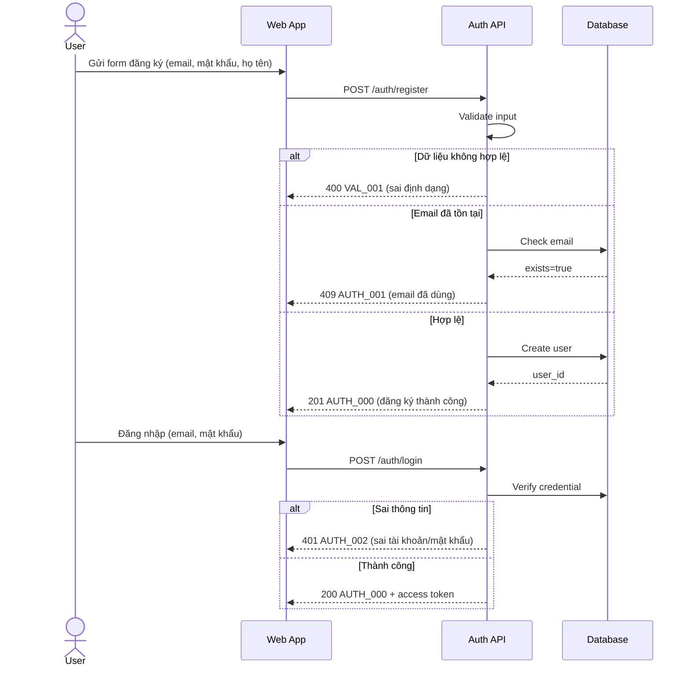
```mermaid
sequenceDiagram
    actor U as User
    participant W as Web App
    participant A as Auth API
    participant DB as Database

    U->>W: Gửi form đăng ký (email, mật khẩu, họ tên)
    W->>A: POST /auth/register
    A->>A: Validate input
    alt Dữ liệu không hợp lệ
        A-->>W: 400 VAL_001 (sai định dạng)
    else Email đã tồn tại
        A->>DB: Check email
        DB-->>A: exists=true
        A-->>W: 409 AUTH_001 (email đã dùng)
    else Hợp lệ
        A->>DB: Create user
        DB-->>A: user_id
        A-->>W: 201 AUTH_000 (đăng ký thành công)
    end

    U->>W: Đăng nhập (email, mật khẩu)
    W->>A: POST /auth/login
    A->>DB: Verify credential
    alt Sai thông tin
        A-->>W: 401 AUTH_002 (sai tài khoản/mật khẩu)
    else Thành công
        A-->>W: 200 AUTH_000 + access token
    end
```

**Validation:**
- email đúng định dạng
- mật khẩu đạt chính sách tối thiểu
- họ tên không rỗng

**Success:**
- `AUTH_000` tạo tài khoản/đăng nhập thành công

**Fail/Error code:**
- `VAL_001` dữ liệu không hợp lệ
- `AUTH_001` email đã tồn tại
- `AUTH_002` thông tin đăng nhập sai
- `SYS_001` lỗi hệ thống không xác định

---

### 13.2. Chức năng tạo project và gán ownership

**Use case chính:** User đã đăng ký tạo project theo sector gợi ý và trở thành owner.

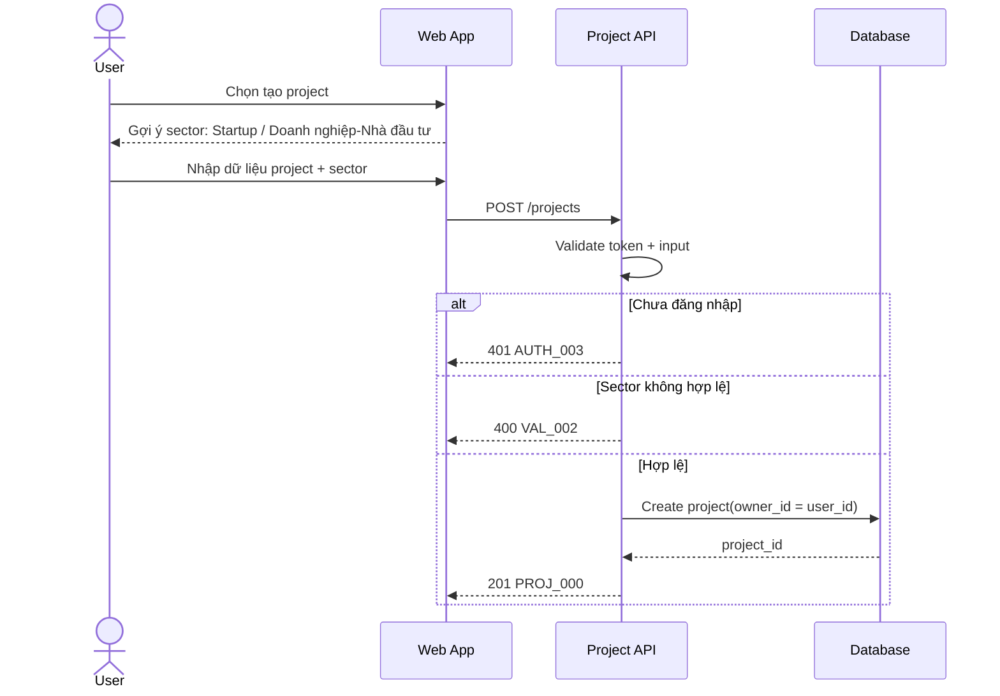
```mermaid
sequenceDiagram
    actor U as User
    participant W as Web App
    participant P as Project API
    participant DB as Database

    U->>W: Chọn tạo project
    W-->>U: Gợi ý sector: Startup / Doanh nghiệp-Nhà đầu tư
    U->>W: Nhập dữ liệu project + sector
    W->>P: POST /projects
    P->>P: Validate token + input
    alt Chưa đăng nhập
        P-->>W: 401 AUTH_003
    else Sector không hợp lệ
        P-->>W: 400 VAL_002
    else Hợp lệ
        P->>DB: Create project(owner_id = user_id)
        DB-->>P: project_id
        P-->>W: 201 PROJ_000
    end
```

**Validation:**
- bắt buộc đăng nhập hợp lệ
- sector thuộc tập cho phép (`Startup`, `Doanh nghiệp/Nhà đầu tư`)
- tiêu đề/mô tả đạt ngưỡng tối thiểu

**Success:**
- `PROJ_000` project tạo thành công, owner được ghi nhận

**Fail/Error code:**
- `AUTH_003` chưa xác thực phiên
- `VAL_002` sector không hợp lệ
- `VAL_003` thiếu trường bắt buộc
- `SYS_002` lỗi khi ghi dữ liệu project

---

### 13.3. Chức năng cập nhật trạng thái project (draft/published/archived)

**Use case chính:** Owner hoặc vai trò được cấp quyền thay đổi trạng thái hiển thị project.

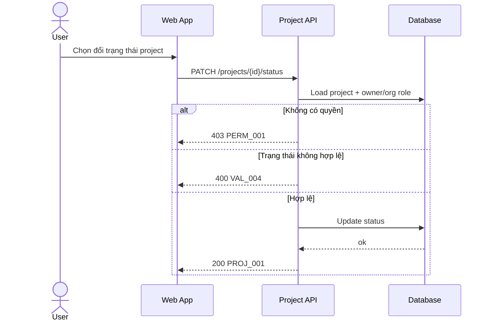
```mermaid
sequenceDiagram
    actor U as User
    participant W as Web App
    participant P as Project API
    participant DB as Database

    U->>W: Chọn đổi trạng thái project
    W->>P: PATCH /projects/{id}/status
    P->>DB: Load project + owner/org role
    alt Không có quyền
        P-->>W: 403 PERM_001
    else Trạng thái không hợp lệ
        P-->>W: 400 VAL_004
    else Hợp lệ
        P->>DB: Update status
        DB-->>P: ok
        P-->>W: 200 PROJ_001
    end
```

**Validation:**
- chỉ cho phép trạng thái trong tập `draft/published/archived`
- kiểm tra ownership hoặc quyền RBAC tương ứng

**Success:**
- `PROJ_001` cập nhật trạng thái thành công

**Fail/Error code:**
- `PERM_001` không có quyền thao tác project
- `VAL_004` trạng thái không hợp lệ
- `BIZ_001` vi phạm điều kiện chuyển trạng thái

---

### 13.4. Chức năng Discover (liệt kê và lọc project)

**Use case chính:** User duyệt các project đã published và lọc theo tiêu chí.

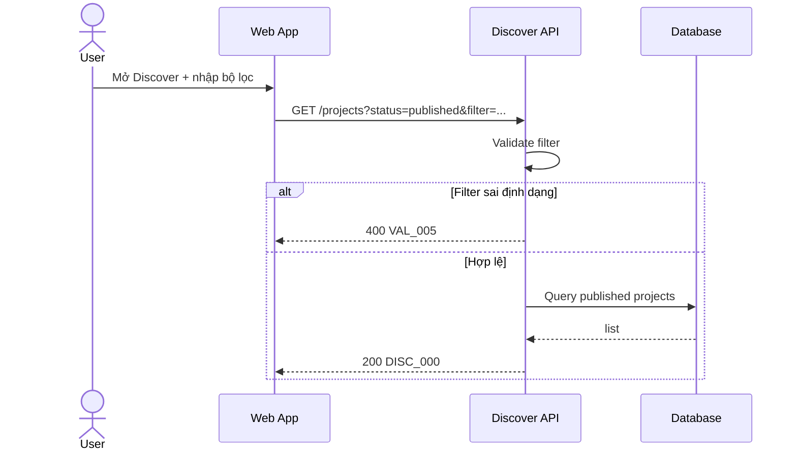
```mermaid
sequenceDiagram
    actor U as User
    participant W as Web App
    participant D as Discover API
    participant DB as Database

    U->>W: Mở Discover + nhập bộ lọc
    W->>D: GET /projects?status=published&filter=...
    D->>D: Validate filter
    alt Filter sai định dạng
        D-->>W: 400 VAL_005
    else Hợp lệ
        D->>DB: Query published projects
        DB-->>D: list
        D-->>W: 200 DISC_000
    end
```

**Validation:**
- filter/sort đúng kiểu dữ liệu
- chỉ truy vấn dữ liệu thuộc phạm vi public/published cho Discover

**Success:**
- `DISC_000` trả danh sách project hợp lệ

**Fail/Error code:**
- `VAL_005` filter không hợp lệ
- `SYS_003` lỗi truy vấn dữ liệu Discover

---

### 13.5. Chức năng gửi yêu cầu truy cập Data Room (protected/confidential)

**Use case chính:** Investor hoặc user đủ điều kiện gửi request truy cập tier cao hơn.

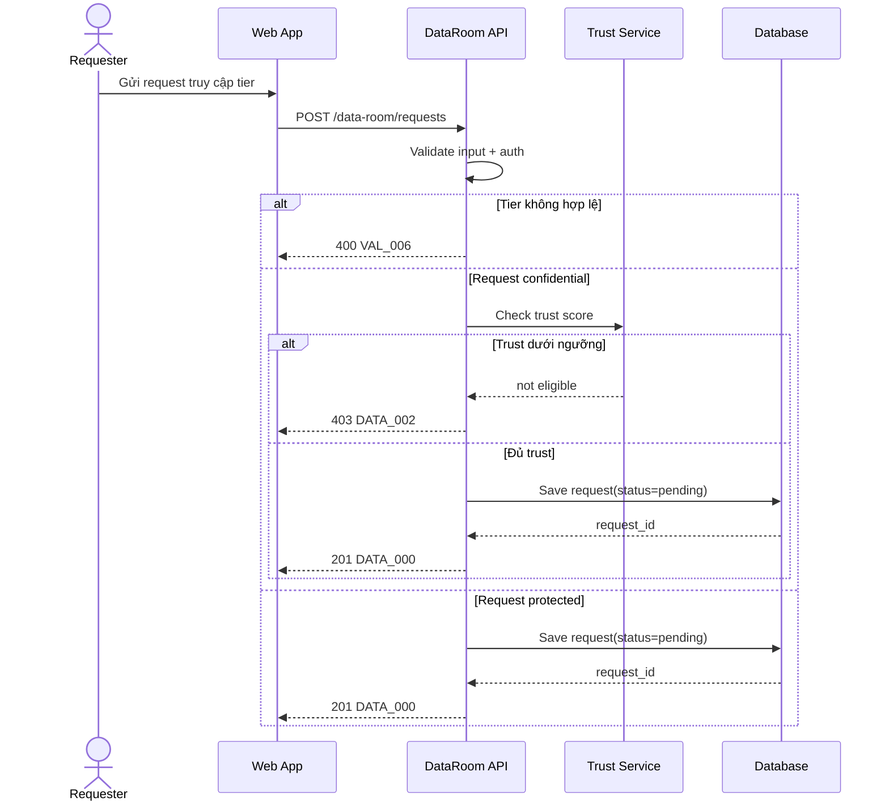
```mermaid
sequenceDiagram
    actor R as Requester
    participant W as Web App
    participant V as DataRoom API
    participant T as Trust Service
    participant DB as Database

    R->>W: Gửi request truy cập tier
    W->>V: POST /data-room/requests
    V->>V: Validate input + auth
    alt Tier không hợp lệ
        V-->>W: 400 VAL_006
    else Request confidential
        V->>T: Check trust score
        alt Trust dưới ngưỡng
            T-->>V: not eligible
            V-->>W: 403 DATA_002
        else Đủ trust
            V->>DB: Save request(status=pending)
            DB-->>V: request_id
            V-->>W: 201 DATA_000
        end
    else Request protected
        V->>DB: Save request(status=pending)
        DB-->>V: request_id
        V-->>W: 201 DATA_000
    end
```

**Validation:**
- tier chỉ nhận `protected` hoặc `confidential`
- bắt buộc có mục đích truy cập
- confidential có thêm điều kiện trust/NDA theo policy

**Success:**
- `DATA_000` tạo request thành công

**Fail/Error code:**
- `VAL_006` tier không hợp lệ
- `VAL_007` thiếu lý do/mục đích request
- `DATA_002` không đạt điều kiện trust cho confidential
- `AUTH_003` chưa xác thực phiên

---

### 13.6. Chức năng phê duyệt/từ chối yêu cầu Data Room

**Use case chính:** Owner/Admin của thực thể sở hữu project xử lý request truy cập.

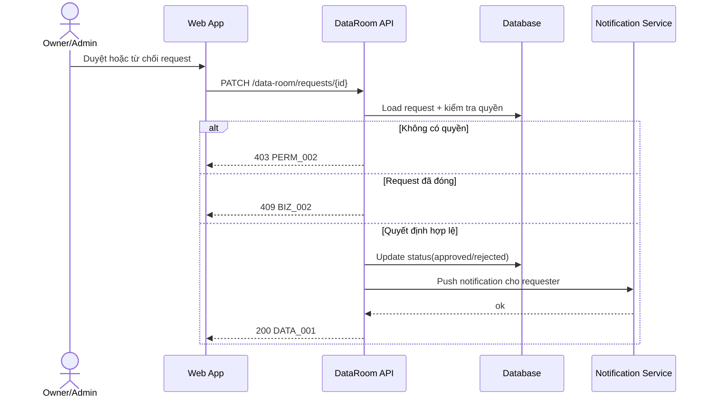
```mermaid
sequenceDiagram
    actor O as Owner/Admin
    participant W as Web App
    participant V as DataRoom API
    participant DB as Database
    participant N as Notification Service

    O->>W: Duyệt hoặc từ chối request
    W->>V: PATCH /data-room/requests/{id}
    V->>DB: Load request + kiểm tra quyền
    alt Không có quyền
        V-->>W: 403 PERM_002
    else Request đã đóng
        V-->>W: 409 BIZ_002
    else Quyết định hợp lệ
        V->>DB: Update status(approved/rejected)
        V->>N: Push notification cho requester
        N-->>V: ok
        V-->>W: 200 DATA_001
    end
```

**Validation:**
- chỉ owner/admin đúng phạm vi tổ chức mới được xử lý
- không xử lý lại request đã hết hiệu lực/đã đóng

**Success:**
- `DATA_001` xử lý request thành công

**Fail/Error code:**
- `PERM_002` không có quyền duyệt
- `BIZ_002` request đã xử lý trước đó
- `SYS_004` lỗi ghi trạng thái request

---

### 13.7. Chức năng xem dữ liệu theo tier sau khi được cấp quyền

**Use case chính:** Người dùng truy cập tài liệu đúng tier trong thời hạn được cấp.

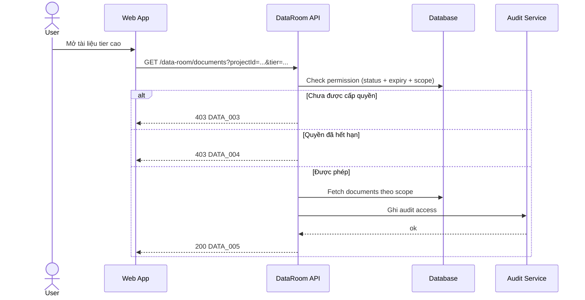
```mermaid
sequenceDiagram
    actor U as User
    participant W as Web App
    participant V as DataRoom API
    participant DB as Database
    participant A as Audit Service

    U->>W: Mở tài liệu tier cao
    W->>V: GET /data-room/documents?projectId=...&tier=...
    V->>DB: Check permission (status + expiry + scope)
    alt Chưa được cấp quyền
        V-->>W: 403 DATA_003
    else Quyền đã hết hạn
        V-->>W: 403 DATA_004
    else Được phép
        V->>DB: Fetch documents theo scope
        V->>A: Ghi audit access
        A-->>V: ok
        V-->>W: 200 DATA_005
    end
```

**Validation:**
- quyền truy cập còn hiệu lực
- tài liệu nằm trong phạm vi tier/scope đã được cấp

**Success:**
- `DATA_005` đọc dữ liệu thành công

**Fail/Error code:**
- `DATA_003` chưa có quyền truy cập
- `DATA_004` quyền đã hết hạn hoặc bị revoke
- `PERM_003` vượt phạm vi tài liệu được cấp

---

### 13.8. Chức năng matching pipeline

**Use case chính:** Tạo và cập nhật trạng thái match theo vòng đời deal.

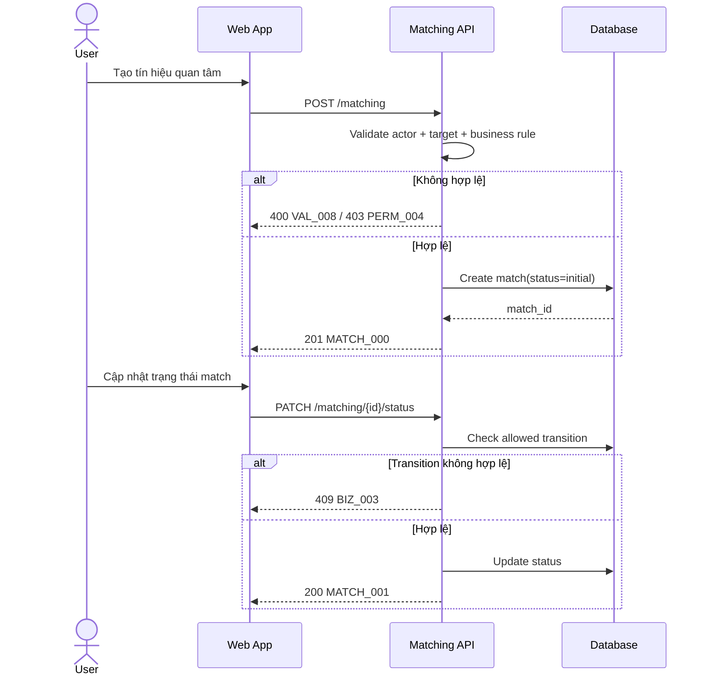
```mermaid
sequenceDiagram
    actor U as User
    participant W as Web App
    participant M as Matching API
    participant DB as Database

    U->>W: Tạo tín hiệu quan tâm
    W->>M: POST /matching
    M->>M: Validate actor + target + business rule
    alt Không hợp lệ
        M-->>W: 400 VAL_008 / 403 PERM_004
    else Hợp lệ
        M->>DB: Create match(status=initial)
        DB-->>M: match_id
        M-->>W: 201 MATCH_000
    end

    U->>W: Cập nhật trạng thái match
    W->>M: PATCH /matching/{id}/status
    M->>DB: Check allowed transition
    alt Transition không hợp lệ
        M-->>W: 409 BIZ_003
    else Hợp lệ
        M->>DB: Update status
        M-->>W: 200 MATCH_001
    end
```

**Validation:**
- actor và target hợp lệ
- trạng thái chỉ chuyển theo đồ thị cho phép

**Success:**
- `MATCH_000` tạo match thành công
- `MATCH_001` cập nhật trạng thái thành công

**Fail/Error code:**
- `VAL_008` dữ liệu match không hợp lệ
- `PERM_004` không đủ quyền thao tác match
- `BIZ_003` chuyển trạng thái không hợp lệ

---

### 13.9. Chức năng hiển thị Trust Score

**Use case chính:** Dashboard/IEC page lấy điểm trust theo tổ chức.

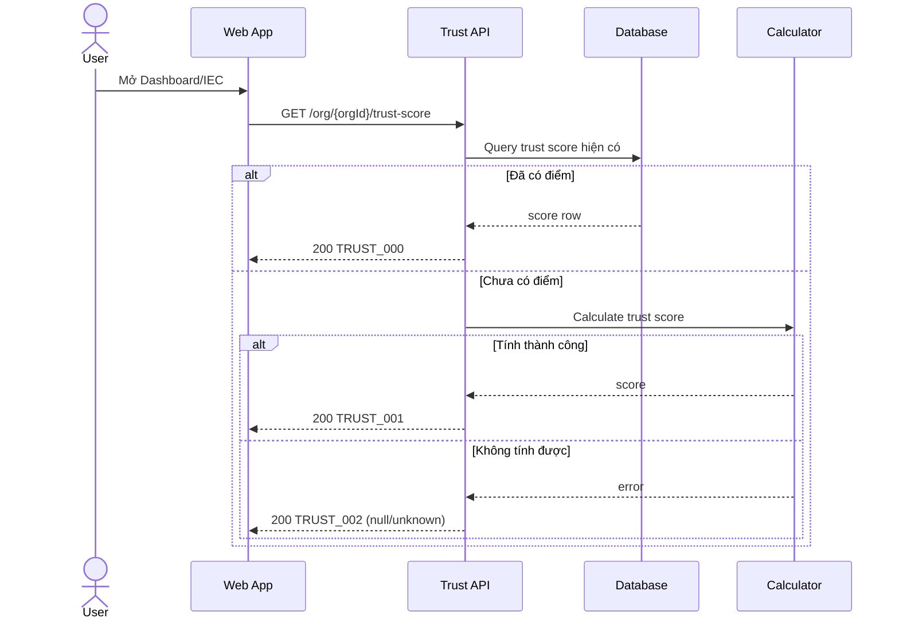
```mermaid
sequenceDiagram
    actor U as User
    participant W as Web App
    participant T as Trust API
    participant DB as Database
    participant C as Calculator

    U->>W: Mở Dashboard/IEC
    W->>T: GET /org/{orgId}/trust-score
    T->>DB: Query trust score hiện có
    alt Đã có điểm
        DB-->>T: score row
        T-->>W: 200 TRUST_000
    else Chưa có điểm
        T->>C: Calculate trust score
        alt Tính thành công
            C-->>T: score
            T-->>W: 200 TRUST_001
        else Không tính được
            C-->>T: error
            T-->>W: 200 TRUST_002 (null/unknown)
        end
    end
```

**Validation:**
- orgId hợp lệ và user có quyền xem theo policy

**Success:**
- `TRUST_000` trả điểm từ dữ liệu có sẵn
- `TRUST_001` trả điểm sau khi tính động
- `TRUST_002` không có điểm nhưng luồng giao diện vẫn hoạt động

**Fail/Error code:**
- `VAL_009` orgId không hợp lệ
- `PERM_005` không có quyền xem trust của tổ chức
- `SYS_005` lỗi dịch vụ trust

---

### 13.10. Chức năng Organization management (mời thành viên và phân quyền)

**Use case chính:** Owner/Admin quản trị thành viên trong tổ chức.

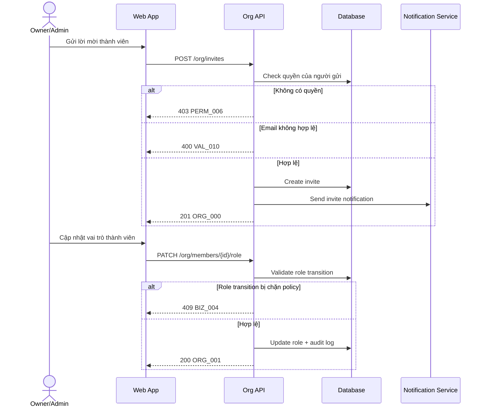
```mermaid
sequenceDiagram
    actor O as Owner/Admin
    participant W as Web App
    participant G as Org API
    participant DB as Database
    participant N as Notification Service

    O->>W: Gửi lời mời thành viên
    W->>G: POST /org/invites
    G->>DB: Check quyền của người gửi
    alt Không có quyền
        G-->>W: 403 PERM_006
    else Email không hợp lệ
        G-->>W: 400 VAL_010
    else Hợp lệ
        G->>DB: Create invite
        G->>N: Send invite notification
        G-->>W: 201 ORG_000
    end

    O->>W: Cập nhật vai trò thành viên
    W->>G: PATCH /org/members/{id}/role
    G->>DB: Validate role transition
    alt Role transition bị chặn policy
        G-->>W: 409 BIZ_004
    else Hợp lệ
        G->>DB: Update role + audit log
        G-->>W: 200 ORG_001
    end
```

**Validation:**
- chỉ owner/admin mới thao tác invite/role
- email lời mời đúng định dạng và chưa là thành viên
- role transition theo policy tổ chức

**Success:**
- `ORG_000` tạo lời mời thành công
- `ORG_001` cập nhật vai trò thành công

**Fail/Error code:**
- `PERM_006` không có quyền quản trị thành viên
- `VAL_010` email không hợp lệ
- `BIZ_004` chuyển vai trò không hợp lệ

---

### 13.11. Chức năng Notifications

**Use case chính:** User nhận danh sách thông báo và cập nhật trạng thái đã đọc.

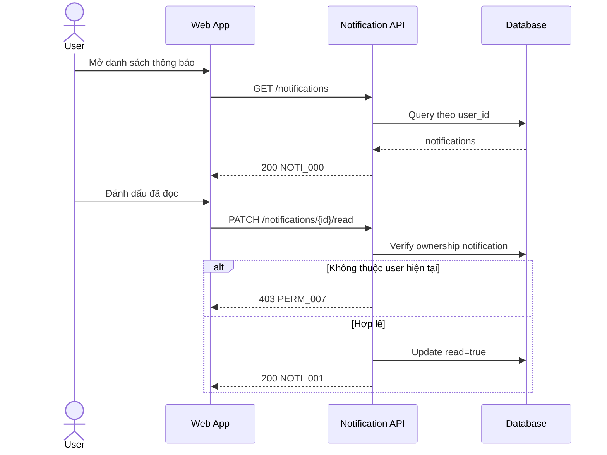
```mermaid
sequenceDiagram
    actor U as User
    participant W as Web App
    participant N as Notification API
    participant DB as Database

    U->>W: Mở danh sách thông báo
    W->>N: GET /notifications
    N->>DB: Query theo user_id
    DB-->>N: notifications
    N-->>W: 200 NOTI_000

    U->>W: Đánh dấu đã đọc
    W->>N: PATCH /notifications/{id}/read
    N->>DB: Verify ownership notification
    alt Không thuộc user hiện tại
        N-->>W: 403 PERM_007
    else Hợp lệ
        N->>DB: Update read=true
        N-->>W: 200 NOTI_001
    end
```

**Validation:**
- chỉ thao tác trên notification thuộc user hiện tại

**Success:**
- `NOTI_000` tải danh sách thành công
- `NOTI_001` cập nhật đã đọc thành công

**Fail/Error code:**
- `PERM_007` không được thao tác notification của user khác
- `SYS_006` lỗi truy xuất notification

---

### 13.12. Chức năng Admin dashboard và audit log

**Use case chính:** Admin xem chỉ số tổng quan và truy vết sự kiện quản trị.

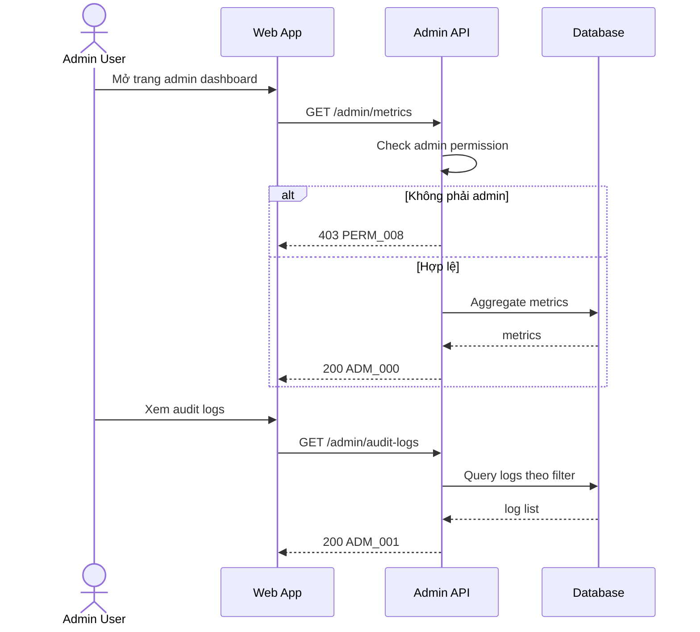
```mermaid
sequenceDiagram
    actor A as Admin User
    participant W as Web App
    participant X as Admin API
    participant DB as Database

    A->>W: Mở trang admin dashboard
    W->>X: GET /admin/metrics
    X->>X: Check admin permission
    alt Không phải admin
        X-->>W: 403 PERM_008
    else Hợp lệ
        X->>DB: Aggregate metrics
        DB-->>X: metrics
        X-->>W: 200 ADM_000
    end

    A->>W: Xem audit logs
    W->>X: GET /admin/audit-logs
    X->>DB: Query logs theo filter
    DB-->>X: log list
    X-->>W: 200 ADM_001
```

**Validation:**
- bắt buộc quyền admin
- filter truy vấn log đúng định dạng

**Success:**
- `ADM_000` tải metrics thành công
- `ADM_001` tải audit logs thành công

**Fail/Error code:**
- `PERM_008` không có quyền admin
- `VAL_011` tham số filter log không hợp lệ
- `SYS_007` lỗi tổng hợp metrics hoặc truy vấn log

---

### 13.13. Bảng chuẩn trạng thái phản hồi

- **Success:** dùng mã `*_000`, `*_001`, ... theo module, kèm dữ liệu xử lý.
- **Fail do dữ liệu đầu vào:** HTTP 400 + `VAL_*`
- **Fail do xác thực:** HTTP 401 + `AUTH_*`
- **Fail do phân quyền:** HTTP 403 + `PERM_*`
- **Fail do vi phạm quy tắc nghiệp vụ:** HTTP 409 + `BIZ_*`
- **Fail hệ thống:** HTTP 500 + `SYS_*`

---

## 14. Tri thức nghiệp vụ chuẩn hóa

Mục này định nghĩa đầy đủ nghiệp vụ của từng cơ chế cốt lõi: nguồn gốc, điều kiện, hành vi hệ thống và lợi ích người dùng nhận được — đủ để triển khai thống nhất.

---

### 14.1. Trust Score — nguồn gốc, thang điểm và quyền lợi theo mức

**Định nghĩa:** Trust Score là chỉ số tin cậy theo tổ chức, thang `0–100`, dùng làm tín hiệu định hướng truy cập và matching.

**Nguồn tín hiệu đầu vào (5 nhóm):**

| Nhóm tín hiệu | Hành động/sự kiện tạo điểm | Trọng số |
|---|---|---|
| **Độ đầy đủ hồ sơ** | Điền đủ các trường bắt buộc của org profile: tên, ngành, mô tả, website, quy mô, giai đoạn | Thấp–trung |
| **Trạng thái xác thực** | Xác thực email công ty; hoàn tất IEC verification do admin duyệt | Cao |
| **Hoạt động vận hành** | Publish project; cập nhật Data Room; phản hồi access request đúng hạn; cập nhật milestone dự án | Trung |
| **Xác thực chéo từ mạng lưới** | Nhận vouch từ org khác trên nền tảng; có testimonial được xác nhận | Cao |
| **Lịch sử vận hành sạch** | Không có vi phạm no-show; không bị flag gian lận dữ liệu; audit log không có sự cố nghiêm trọng | Cao (trừ điểm nếu vi phạm) |

> Trọng số cụ thể do hệ thống cấu hình. Điểm được cập nhật theo sự kiện thực tế, không phải theo lịch cố định.

**Trust Level và quyền lợi kèm theo:**

| Level | Dải điểm | Quyền lợi / năng lực mở thêm |
|---|---|---|
| `Newcomer` | 0–24 | Khám phá Discover; gửi tín hiệu quan tâm; xem tài liệu public |
| `Verified` | 25–49 | Đủ điều kiện gửi request truy cập tầng `protected` |
| `Trusted` | 50–74 | Ưu tiên cao hơn trong kết quả Discover; tín hiệu matching được đối tác đánh giá cao hơn |
| `Elite` | 75–100 | Đủ điều kiện gửi request tầng `confidential` khi chủ dự án bật gating Trust; tín hiệu mạnh nhất trong pipeline |

**Luồng cập nhật Trust Score theo sự kiện:**

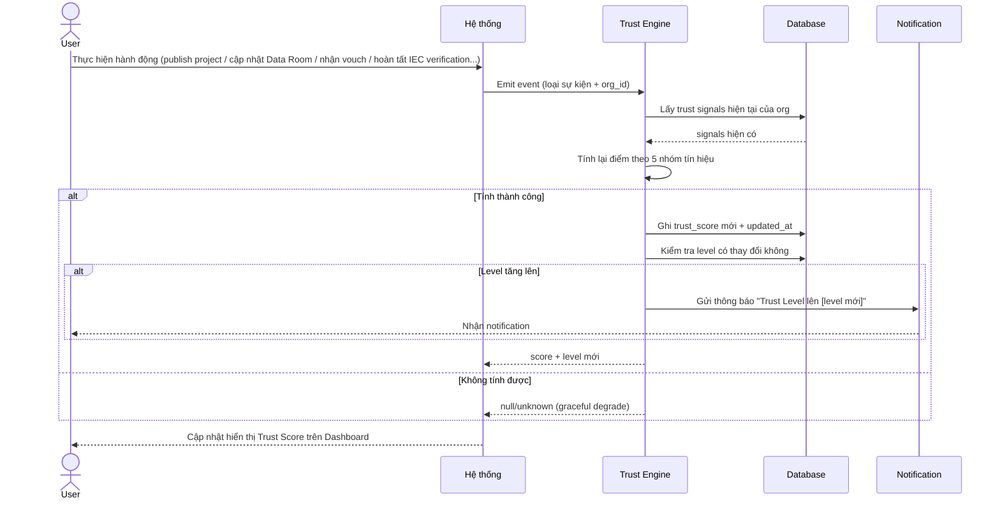
```mermaid
sequenceDiagram
    actor U as User
    participant S as Hệ thống
    participant TE as Trust Engine
    participant DB as Database
    participant N as Notification

    U->>S: Thực hiện hành động (publish project / cập nhật Data Room / nhận vouch / hoàn tất IEC verification...)
    S->>TE: Emit event (loại sự kiện + org_id)
    TE->>DB: Lấy trust signals hiện tại của org
    DB-->>TE: signals hiện có
    TE->>TE: Tính lại điểm theo 5 nhóm tín hiệu
    alt Tính thành công
        TE->>DB: Ghi trust_score mới + updated_at
        TE->>DB: Kiểm tra level có thay đổi không
        alt Level tăng lên
            TE->>N: Gửi thông báo "Trust Level lên [level mới]"
            N-->>U: Nhận notification
        end
        TE-->>S: score + level mới
    else Không tính được
        TE-->>S: null/unknown (graceful degrade)
    end
    S-->>U: Cập nhật hiển thị Trust Score trên Dashboard
```

**BR-TRUST-01:** Gating trust trên tầng `confidential` là tùy chọn của owner — khi bật, hệ thống từ chối request từ tổ chức không đạt ngưỡng được cấu hình (ví dụ `>= 60`), không thay đổi định nghĩa Trust Level.

**BR-TRUST-02:** Khi không tính được điểm, hệ thống trả `null/unknown` và hiển thị gracefully — luồng nghiệp vụ không bị dừng.

**BR-TRUST-03:** Trust Score thuộc về tổ chức (org), không phải cá nhân. Một user thuộc nhiều org có thể có nhiều trust context khác nhau.

---

### 14.2. Data Room — cơ chế tier, quy trình request và thời hạn truy cập

**Mục đích:** Cho phép Startup kiểm soát chặt chẽ ai được xem tài liệu gì, đồng thời cho Investor biết rõ mình đang ở bước nào trong quy trình tiếp cận thông tin.

**Định nghĩa ba tier:**

| Tier | Loại tài liệu điển hình | Điều kiện truy cập |
|---|---|---|
| `public` | Pitch deck tóm tắt, mô tả sản phẩm, case study | Không cần request; hiển thị mặc định cho mọi user |
| `protected` | Tài chính tổng quan, roadmap, đội ngũ chi tiết | Request có `purpose`; xác nhận NDA trên UI; phê duyệt của owner/admin |
| `confidential` | Financials đầy đủ, IP chi tiết, data room đầu tư | Request có `purpose`; NDA; phê duyệt; và có thể yêu cầu ngưỡng Trust tối thiểu theo policy của owner |

**Quy trình request truy cập (áp dụng cho `protected` và `confidential`):**

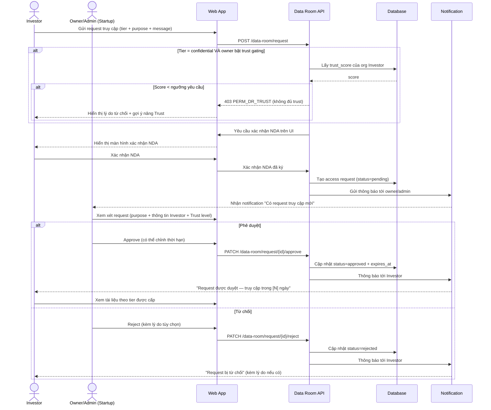
```mermaid
sequenceDiagram
    actor I as Investor
    actor O as Owner/Admin (Startup)
    participant W as Web App
    participant DR as Data Room API
    participant DB as Database
    participant N as Notification

    I->>W: Gửi request truy cập (tier + purpose + message)
    W->>DR: POST /data-room/request

    alt Tier = confidential VÀ owner bật trust gating
        DR->>DB: Lấy trust_score của org Investor
        DB-->>DR: score
        alt Score < ngưỡng yêu cầu
            DR-->>W: 403 PERM_DR_TRUST (không đủ trust)
            W-->>I: Hiển thị lý do từ chối + gợi ý nâng Trust
        end
    end

    DR->>W: Yêu cầu xác nhận NDA trên UI
    W-->>I: Hiển thị màn hình xác nhận NDA
    I->>W: Xác nhận NDA
    W->>DR: Xác nhận NDA đã ký

    DR->>DB: Tạo access request (status=pending)
    DR->>N: Gửi thông báo tới owner/admin
    N-->>O: Nhận notification "Có request truy cập mới"

    O->>W: Xem xét request (purpose + thông tin Investor + Trust level)
    alt Phê duyệt
        O->>W: Approve (có thể chỉnh thời hạn)
        W->>DR: PATCH /data-room/request/{id}/approve
        DR->>DB: Cập nhật status=approved + expires_at
        DR->>N: Thông báo tới Investor
        N-->>I: "Request được duyệt — truy cập trong [N] ngày"
        I->>W: Xem tài liệu theo tier được cấp
    else Từ chối
        O->>W: Reject (kèm lý do tùy chọn)
        W->>DR: PATCH /data-room/request/{id}/reject
        DR->>DB: Cập nhật status=rejected
        DR->>N: Thông báo tới Investor
        N-->>I: "Request bị từ chối" (kèm lý do nếu có)
    end
```

**Thời hạn truy cập:**

| Tier | Mặc định | Tối đa |
|---|---|---|
| `protected` | 30 ngày | 90 ngày |
| `confidential` | 14 ngày | 30 ngày |

**BR-DR-01:** Hết hạn → quyền truy cập tự thu hồi. Bên quan tâm gửi request mới nếu vẫn cần.

**BR-DR-02:** Owner/admin có thể revoke quyền bất cứ lúc nào, không phụ thuộc thời hạn còn lại.

**BR-DR-03:** Mọi quyết định (approve/reject/revoke) và sự kiện truy cập quan trọng phải có audit log với timestamp và actor.

---

### 14.3. Matching pipeline — vòng đời trạng thái và điều kiện chuyển

**Mục đích:** Tạo không gian chung minh bạch để cả hai phía theo dõi tiến trình deal — tránh mất dấu nhau giữa các kênh.

**Vòng đời trạng thái match:**

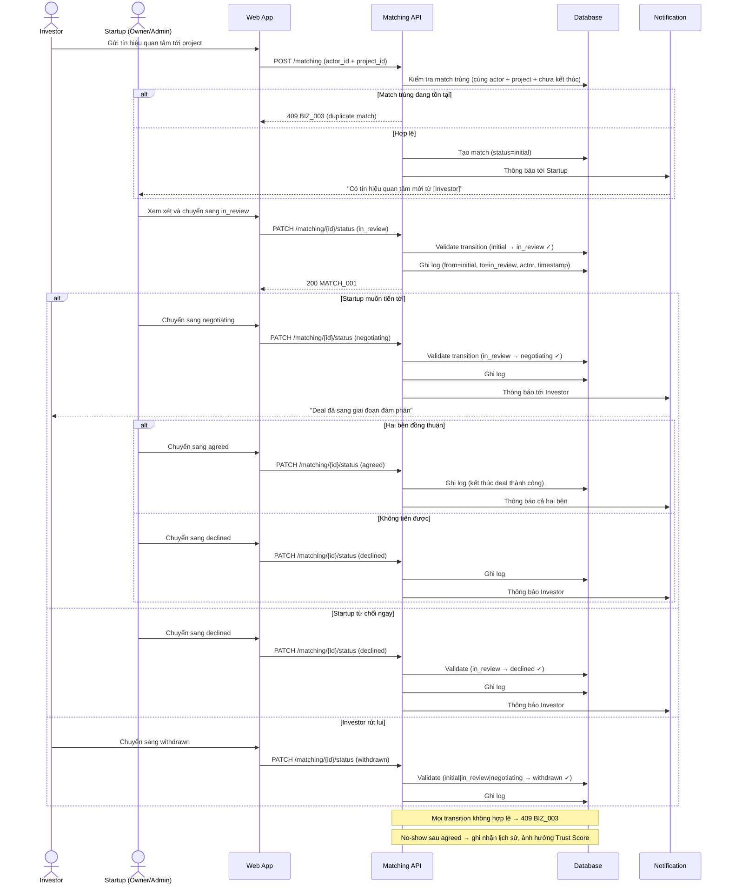
```mermaid
sequenceDiagram
    actor I as Investor
    actor S as Startup (Owner/Admin)
    participant W as Web App
    participant M as Matching API
    participant DB as Database
    participant N as Notification

    I->>W: Gửi tín hiệu quan tâm tới project
    W->>M: POST /matching (actor_id + project_id)
    M->>DB: Kiểm tra match trùng (cùng actor + project + chưa kết thúc)
    alt Match trùng đang tồn tại
        M-->>W: 409 BIZ_003 (duplicate match)
    else Hợp lệ
        M->>DB: Tạo match (status=initial)
        M->>N: Thông báo tới Startup
        N-->>S: "Có tín hiệu quan tâm mới từ [Investor]"
    end

    S->>W: Xem xét và chuyển sang in_review
    W->>M: PATCH /matching/{id}/status (in_review)
    M->>DB: Validate transition (initial → in_review ✓)
    M->>DB: Ghi log (from=initial, to=in_review, actor, timestamp)
    M-->>W: 200 MATCH_001

    alt Startup muốn tiến tới
        S->>W: Chuyển sang negotiating
        W->>M: PATCH /matching/{id}/status (negotiating)
        M->>DB: Validate transition (in_review → negotiating ✓)
        M->>DB: Ghi log
        M->>N: Thông báo tới Investor
        N-->>I: "Deal đã sang giai đoạn đàm phán"

        alt Hai bên đồng thuận
            S->>W: Chuyển sang agreed
            W->>M: PATCH /matching/{id}/status (agreed)
            M->>DB: Ghi log (kết thúc deal thành công)
            M->>N: Thông báo cả hai bên
        else Không tiến được
            S->>W: Chuyển sang declined
            W->>M: PATCH /matching/{id}/status (declined)
            M->>DB: Ghi log
            M->>N: Thông báo Investor
        end
    else Startup từ chối ngay
        S->>W: Chuyển sang declined
        W->>M: PATCH /matching/{id}/status (declined)
        M->>DB: Validate (in_review → declined ✓)
        M->>DB: Ghi log
        M->>N: Thông báo Investor
    else Investor rút lui
        I->>W: Chuyển sang withdrawn
        W->>M: PATCH /matching/{id}/status (withdrawn)
        M->>DB: Validate (initial|in_review|negotiating → withdrawn ✓)
        M->>DB: Ghi log
    end

    note over M,DB: Mọi transition không hợp lệ → 409 BIZ_003
    note over M,DB: No-show sau agreed → ghi nhận lịch sử, ảnh hưởng Trust Score
```

| Trạng thái | Ý nghĩa nghiệp vụ | Ai có thể chuyển |
|---|---|---|
| `initial` | Tín hiệu quan tâm vừa được tạo | Hệ thống (khi user gửi interest) |
| `in_review` | Startup đang xem xét, chưa có phản hồi chính thức | Startup (owner/admin) |
| `negotiating` | Hai bên đã xác nhận quan tâm, đang trao đổi chi tiết | Cả hai phía |
| `agreed` | Deal chốt thành công | Startup (owner/admin) |
| `declined` | Startup từ chối | Startup (owner/admin) |
| `withdrawn` | Investor/bên quan tâm rút lui | Bên đã tạo match |

**BR-MATCH-01:** Chuyển trạng thái chỉ hợp lệ theo đồ thị trên — hệ thống từ chối transition không hợp lệ (`BIZ_003`).

**BR-MATCH-02:** Mỗi lần chuyển trạng thái ghi log với `timestamp`, `actor_id` và `from_status → to_status`.

**BR-MATCH-03:** Không được tạo match trùng (cùng actor + cùng project + đang có match chưa kết thúc).

**BR-MATCH-04 (no-show):** Hành vi no-show sau khi đạt `agreed` được ghi nhận vào lịch sử vận hành và có thể ảnh hưởng Trust Score theo policy.

---

### 14.4. Ownership và phân quyền trong tổ chức

**Nguyên tắc:** Ownership rõ ràng là nền móng để trao quyền vận hành mà không mất kiểm soát.

**Bảng thẩm quyền theo vai trò:**

| Thao tác | `owner` | `admin` | `member` | `viewer` |
|---|:---:|:---:|:---:|:---:|
| Tạo / xóa project | ✓ | — | — | — |
| Cập nhật nội dung project | ✓ | ✓ | ✓ | — |
| Publish / archive project | ✓ | ✓ | — | — |
| Tạo / quản lý Data Room | ✓ | ✓ | ✓ | — |
| Approve / reject access request | ✓ | ✓ | — | — |
| Revoke quyền truy cập | ✓ | ✓ | — | — |
| Mời thành viên | ✓ | ✓ | — | — |
| Thay đổi vai trò thành viên | ✓ | ✓* | — | — |
| Xem audit log nội bộ | ✓ | ✓ | — | — |

> *Admin không thể thay đổi vai trò của Owner.

**Luồng mời thành viên và phân quyền:**

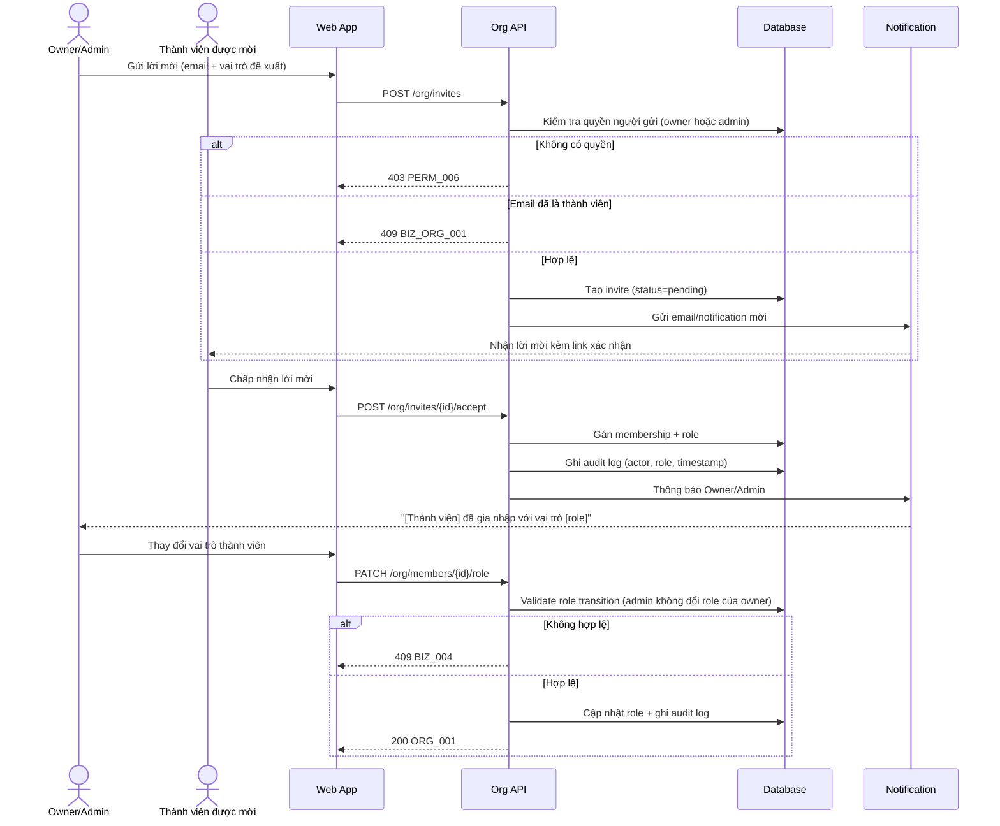
```mermaid
sequenceDiagram
    actor O as Owner/Admin
    actor M as Thành viên được mời
    participant W as Web App
    participant G as Org API
    participant DB as Database
    participant N as Notification

    O->>W: Gửi lời mời (email + vai trò đề xuất)
    W->>G: POST /org/invites
    G->>DB: Kiểm tra quyền người gửi (owner hoặc admin)
    alt Không có quyền
        G-->>W: 403 PERM_006
    else Email đã là thành viên
        G-->>W: 409 BIZ_ORG_001
    else Hợp lệ
        G->>DB: Tạo invite (status=pending)
        G->>N: Gửi email/notification mời
        N-->>M: Nhận lời mời kèm link xác nhận
    end

    M->>W: Chấp nhận lời mời
    W->>G: POST /org/invites/{id}/accept
    G->>DB: Gán membership + role
    G->>DB: Ghi audit log (actor, role, timestamp)
    G->>N: Thông báo Owner/Admin
    N-->>O: "[Thành viên] đã gia nhập với vai trò [role]"

    O->>W: Thay đổi vai trò thành viên
    W->>G: PATCH /org/members/{id}/role
    G->>DB: Validate role transition (admin không đổi role của owner)
    alt Không hợp lệ
        G-->>W: 409 BIZ_004
    else Hợp lệ
        G->>DB: Cập nhật role + ghi audit log
        G-->>W: 200 ORG_001
    end
```

**BR-OWN-01:** Account tạo project là owner của project đó — ghi nhận tại thời điểm tạo, không thay đổi tự động.

**BR-OWN-02:** Một owner có thể tạo nhiều project profiles. Mỗi project có Data Room và pipeline riêng độc lập.

**BR-OWN-03:** RBAC luôn được đánh giá theo ngữ cảnh tổ chức sở hữu tài nguyên — không có quyền xuyên tổ chức.

**BR-OWN-04:** Mọi thay đổi membership và role phải có audit log.

---

### 14.5. Chất lượng dữ liệu dự án — "dữ liệu sống" và vòng lặp Trust

**Định nghĩa "dữ liệu sống":** Project được coi là có dữ liệu sống khi có ít nhất một trong các hành động sau xảy ra trong 30 ngày gần nhất: cập nhật milestone, thêm tài liệu vào Data Room, phản hồi access request, hoặc cập nhật nội dung project.

**Luồng ghi nhận hoạt động và cập nhật Trust:**

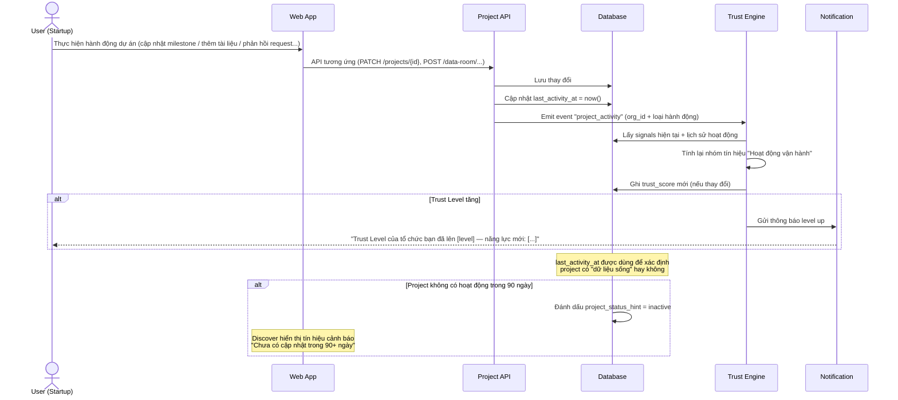
```mermaid
sequenceDiagram
    actor U as User (Startup)
    participant W as Web App
    participant P as Project API
    participant DB as Database
    participant TE as Trust Engine
    participant N as Notification

    U->>W: Thực hiện hành động dự án (cập nhật milestone / thêm tài liệu / phản hồi request...)
    W->>P: API tương ứng (PATCH /projects/{id}, POST /data-room/...)
    P->>DB: Lưu thay đổi
    P->>DB: Cập nhật last_activity_at = now()
    P->>TE: Emit event "project_activity" (org_id + loại hành động)

    TE->>DB: Lấy signals hiện tại + lịch sử hoạt động
    TE->>TE: Tính lại nhóm tín hiệu "Hoạt động vận hành"
    TE->>DB: Ghi trust_score mới (nếu thay đổi)

    alt Trust Level tăng
        TE->>N: Gửi thông báo level up
        N-->>U: "Trust Level của tổ chức bạn đã lên [level] — năng lực mới: [...]"
    end

    note over DB: last_activity_at được dùng để xác định<br/>project có "dữ liệu sống" hay không

    alt Project không có hoạt động trong 90 ngày
        DB->>DB: Đánh dấu project_status_hint = inactive
        note over W: Discover hiển thị tín hiệu cảnh báo<br/>"Chưa có cập nhật trong 90+ ngày"
    end
```

**BR-DATA-01:** Project không có hoạt động trong 90 ngày hiển thị trạng thái `inactive` trong Discover (vẫn visible nhưng có tín hiệu cảnh báo cho người xem).

**BR-DATA-02:** Hệ thống ghi nhận `last_activity_at` cho mỗi project, cập nhật theo sự kiện thực tế (không phải theo lịch cron).

**BR-DATA-03:** Investor/bên xem có thể thấy tín hiệu hoạt động gần nhất của project (không phải nội dung chi tiết, chỉ là timestamp và loại sự kiện) để đánh giá mức độ "sống" của dự án trước khi gửi request.

---

## Document Control

| Trường | Giá trị |
|--------|---------|
| Version | 5.4 |
| Owner | IEC Hub Product Team |
| Last Updated | 31/03/2026 |
| Status | Draft |
| Next Review | 25/04/2026 |

<details>
<summary>Phụ lục legacy (không dùng triển khai)</summary>
# IEC Hub - Software Requirements Specification (SRS)

**Product:** IEC Hub - Trust-based B2B Data Infrastructure  
**Version:** 5.0 (single-source SRS)  
**Last Updated:** 25/03/2026  
**Status:** Draft for implementation handoff  

---

## 1. Purpose and Scope

This SRS defines the functional and non-functional requirements for IEC Hub web platform.

Primary goal:
- reduce information asymmetry in B2B matching between startups, investors, and SMEs,
- convert static profiles into structured, verifiable, and continuously updated project evidence,
- enable controlled data sharing using tiered access and approval workflow.

This document is the canonical SRS for implementation. It replaces mixed or legacy SRS fragments.

---

## 2. Product Context

IEC Hub is a trust infrastructure for business matching, not a social network for engagement-first behavior.

Core principles:
- trust is built through workflow and evidence, not claims,
- access rights follow role and context,
- higher-sensitivity data requires explicit request, approval, and time-bound access.

---

## 3. Users and Roles

## 3.1 User Types (registration and project profile suggestion)

After a user registers an account, the user can create project profiles with two suggested sectors:
- `Startup` - technology company
- `Enterprise/Investor` - business investor profile

The account that creates a project is recorded as the **owner** of that project.
One owner account can create and manage multiple project profiles.

## 3.2 Organization Roles (RBAC inside organization)

- `owner`: full control, role management, governance actions
- `admin`: manage members/invites and operational approvals
- `member`: create/update working resources under granted policy
- `viewer`: read-only access where applicable

RBAC is evaluated in the context of the organization that owns the resource.

---

## 4. Core Domain Objects

- `User`: personal account and authentication identity
- `Organization (OA)`: business entity context for collaboration
- `Project`: published or draft business/project profile
- `Data Room`: tiered documents attached to project
- `Data Access Request`: request to view protected/confidential data
- `Match`: relationship pipeline between interested parties
- `Trust Score`: trust signal (0-100) for guidance and gating
- `Notification`: system event and action reminders
- `Audit Log`: immutable operation record for governance

---

## 5. Functional Requirements

## 5.1 Authentication and Identity

FR-AUTH-01: User can register with email and password.  
FR-AUTH-02: User can sign in and sign out securely.  
FR-AUTH-03: User sees profile and approval/verification status.

## 5.2 Project Creation, Ownership, and Lifecycle

FR-PROJ-01: Registered user can create project.
FR-PROJ-02: During creation, system suggests two project sectors:
- Startup (technology company)
- Enterprise/Investor (business investor)

FR-PROJ-03: Creator account is stored as project owner.
FR-PROJ-04: One owner account can create multiple project profiles.
FR-PROJ-05: Project status supports `draft`, `published`, and `archived`.
FR-PROJ-06: Only `published` projects appear in Discover.
FR-PROJ-07: Owner (and authorized org roles by RBAC policy) can update project content and status.

## 5.3 Discover and Project Viewing

FR-DISC-01: Discover lists published projects only.
FR-DISC-02: Discover supports search and filtering (minimum: keyword, industry).
FR-DISC-03: Project detail page exposes public data without leaking restricted tier content.

## 5.4 Data Room and Tiered Access

FR-DR-01: Each project may have Data Room with 3 tiers:
- `public`
- `protected`
- `confidential`

FR-DR-02: Public tier is visible by default according to visibility policy.
FR-DR-03: Protected tier requires request with stated purpose and owner/admin approval.
FR-DR-04: Confidential tier requires stricter conditions:
- explicit request,
- approval by authorized approver,
- NDA confirmation flow in UI,
- optional trust threshold policy.

FR-DR-05: Approved access is time-bound and revocable.
FR-DR-06: Access decisions and important access events are auditable.

## 5.5 Matching Pipeline

FR-MATCH-01: User can express interest and create matching pipeline entries.
FR-MATCH-02: Match progresses through defined statuses.
FR-MATCH-03: Pipeline history is preserved for traceability.

## 5.6 Trust Score and Verification

FR-TRUST-01: System shows trust score and trust/IEC level for organization context.
FR-TRUST-02: Trust score is computed from structured signals (profile completeness, verification state, activity, trust interactions, audit signals).
FR-TRUST-03: Trust score may be used as gating signal for higher-tier access.
FR-TRUST-04: If score cannot be resolved, system degrades gracefully without breaking primary flows.

## 5.7 Organization Management

FR-ORG-01: Owner/admin can invite members.
FR-ORG-02: Owner/admin can manage role assignments under policy.
FR-ORG-03: Membership changes are logged.

## 5.8 Notifications

FR-NOTI-01: User can list notifications.
FR-NOTI-02: User can mark notification as read.
FR-NOTI-03: Critical workflow events trigger notifications (access request updates, match state changes, etc.).

## 5.9 Admin and Audit

FR-ADM-01: Admin dashboard shows key operational metrics.
FR-ADM-02: Audit logs are available for governance and incident review.

## 5.10 Events (optional module)

FR-EVT-01: Events UI can be enabled/disabled via environment configuration.
FR-EVT-02: Core product flow remains functional when Events is off.

---

## 6. Business Rules

BR-01 (Project visibility): Only `published` projects are discoverable.

BR-02 (Project ownership): Project creator account is owner of that project.

BR-03 (Multi-profile ownership): One owner account may create multiple project profiles.

BR-04 (Tier progression): Access to deeper tiers follows explicit request and approval workflow.

BR-05 (Approval authority): Data room access approvals are performed by authorized project/org approvers per RBAC policy.

BR-06 (Time-bound access): Protected/confidential grants have expiration and can be revoked.

BR-07 (Trust gating): Confidential access can require trust threshold and NDA confirmation.

BR-08 (Least privilege): Default access is minimal; elevated access requires explicit grant.

BR-09 (Auditability): Governance-critical actions must be auditable.

---

## 7. Use Case Flows (Condensed)

## UC-01: Register -> Create Project
1. User registers account.
2. User creates project.
3. System suggests 2 sectors: Startup, Enterprise/Investor.
4. User selects sector and submits.
5. System sets creator account as owner.
6. Owner can create additional project profiles.

## UC-02: Publish -> Discover
1. Owner moves project from draft to published.
2. Project appears in Discover.
3. Other users can search/view public content.

## UC-03: Request Data Access
1. Viewer requests protected/confidential access with purpose.
2. Owner/admin reviews request.
3. Approver accepts or rejects (with optional note).
4. If accepted, access is active until expiration/revocation.

## UC-04: Trust-guided Confidential Access
1. User requests confidential tier.
2. System evaluates policy (NDA + trust threshold + approver decision).
3. Access granted or denied with clear status.

---

## 8. API-Level Requirement Summary

This section is normative at behavior level, not full OpenAPI.

- Auth APIs support register/login/session flows.
- Projects APIs support create/read/update/status for owned resources.
- Discover/API listing returns published projects only.
- Data room APIs support request/approve/reject/list flows with authorization.
- Trust APIs expose trust score/level by organization context.
- Org APIs support member/invite operations by authorized roles.
- Notifications APIs support list and mark-read.
- Admin APIs expose operational metrics and audit data.

Any endpoint contract must conform to FR/BR above and cannot weaken ownership or tier control semantics.

---

## 9. Non-Functional Requirements

## 9.1 Performance
- P95 for key list/search APIs should stay within practical interactive thresholds.
- Dashboard and Discover should remain responsive under expected concurrent load.

## 9.2 Security
- JWT-based authenticated sessions for protected operations.
- Password hashing with modern secure algorithm.
- Role and ownership checks on all mutating endpoints.
- Input validation and consistent error handling.

## 9.3 Reliability
- Failure in optional modules (e.g., Events) must not break core workflows.
- Trust-score resolution failures should degrade gracefully.

## 9.4 Audit and Compliance
- Governance-critical operations produce immutable audit records.
- Access decisions for sensitive data are traceable.

---

## 10. Out of Scope

- Full social-network style feed optimization as primary objective.
- Fully automated meeting booking orchestration as mandatory core flow.
- Claims not represented in implemented platform capabilities.

---

## 11. Traceability to BRD

This SRS is aligned with:
- customer-facing narrative in `docs/BRD_customer.md`,
- project ownership rule: registered account can create project, choose suggested sector, and own multiple project profiles.

If BRD changes materially, SRS must be updated in the same change set.

---

## 12. Document Governance

- This file is the canonical SRS for the project.
- Do not create additional SRS files without explicit confirmation from product owner.
- Proposed SRS restructure must be reviewed before file split/rename.

---

## Document Control

- Version: 5.0
- Owner: IEC Hub Product Team
- Last Updated: 25/03/2026
- Status: Draft
- Next Review: 25/04/2026

# IEC Hub – Software Requirements Specification (SRS v4.0)

**Dự án:** IEC Hub - Trust-based B2B Data Infrastructure  
**Phiên bản:** 4.0  
**Ngày cập nhật:** 22/03/2026  

---

## 1. Giới thiệu

### 1.1. Mục đích

Tài liệu này mô tả chi tiết các yêu cầu phần mềm cho hệ thống IEC Hub - một **Hạ tầng dữ liệu tin cậy B2B** (Trust-based B2B Data Infrastructure) nhằm:

- Xóa bỏ sự "bất đối xứng thông tin" trong giao thương B2B
- Biến hồ sơ năng lực "chết" thành **Thực thể dữ liệu sống**
- Xây dựng **Vốn xã hội (Social Capital)** thay vì tiền ảo/credit

### 1.2. Phạm vi

Hệ thống bao gồm 5 EPIC chính:
1. **Identity & OA Management** - Định danh và quản lý tổ chức Multi-tenant
2. **Dynamic Project Feed & AI Matching** - Bảng tin thông minh và matching
3. **Tiered Data Exchange** - Chia sẻ dữ liệu 3 tầng bảo mật
4. **Event Facilitation** - Sự kiện và booking làm công cụ "chạm"
5. **Reputation & Social Capital** - Hệ thống vinh danh và Trust Score

### 1.3. Đối tượng

- Product Owner, Business Analyst
- Development Team (Frontend, Backend, DevOps)
- QA/Testing Team
- Stakeholders

### 1.4. Thuật ngữ

| Thuật ngữ | Định nghĩa |
|-----------|------------|
| **OA** | Organization Account - Tài khoản doanh nghiệp |
| **Trust Score** | Điểm tin cậy (0-100) |
| **Data Vault** | Kho dữ liệu 3 tầng bảo mật |
| **Vouch** | Xác thực chéo giữa các OA |
| **Feed** | Bảng tin được cá nhân hóa bởi AI |

---

## 2. Yêu cầu chức năng

### EPIC 1: Identity & OA Management (The Gatekeeper)

#### UC 1.1: Đăng ký User với Email Công ty

**Actor:** Guest (chưa đăng ký)

**Preconditions:** Không có

**Main Flow:**

| Step | Actor | Action | System Response |
|------|-------|--------|-----------------|
| 1 | Guest | Nhập email để đăng ký | Validate email domain |
| 2 | System | Kiểm tra domain | CHẶN nếu là consumer email (gmail, yahoo, etc.) |
| 3 | System | | Gửi OTP/Link verification đến email |
| 4 | Guest | Click link hoặc nhập OTP | Xác thực email |
| 5 | Guest | Nhập thông tin cơ bản (name, password) | Tạo User account |
| 6 | System | | Redirect đến Dashboard với prompt tạo OA |

**Alternative Flow:**
- 2a. Email domain bị block → Hiển thị: "Vui lòng sử dụng email công ty"
- 2b. Email đã tồn tại → Hiển thị: "Email đã được đăng ký"
- 4a. OTP/Link hết hạn → Cho phép gửi lại

**Business Rules:**
```
BLOCKED_DOMAINS = [
  'gmail.com', 'yahoo.com', 'hotmail.com', 'outlook.com',
  'mail.com', 'aol.com', 'icloud.com', 'protonmail.com',
  'yandex.com', 'zoho.com', 'gmx.com', 'live.com'
]

WHITELIST_DOMAINS = [
  'thinkzone.vn', 'topica.edu.vn', 'fpt.edu.vn'  // Accelerators, Universities
]
```

**Postconditions:** User account được tạo với email_verified = true

---

#### UC 1.2: Đăng nhập

**Actor:** Registered User

**Main Flow:**

| Step | Actor | Action | System Response |
|------|-------|--------|-----------------|
| 1 | User | Nhập email + password | Validate credentials |
| 2 | System | | Kiểm tra email_verified |
| 3 | System | | Generate JWT tokens (access + refresh) |
| 4 | System | | Trả về user info + tokens |
| 5 | System | | Redirect theo authStep (dashboard/verify-email) |

**Alternative Flow:**
- 2a. Email chưa verified → Redirect đến verify-email page
- 2b. Sai password → Hiển thị: "Email hoặc mật khẩu không đúng"
- 2c. Account bị lock → Hiển thị: "Tài khoản đã bị khóa"

---

#### UC 1.3: Tạo Organization Account (OA)

**Actor:** Verified User

**Preconditions:** User đã verify email

**Main Flow:**

| Step | Actor | Action | System Response |
|------|-------|--------|-----------------|
| 1 | User | Chọn loại OA (Startup/Investor/SME/Researcher) | Hiển thị form phù hợp |
| 2 | User | Nhập thông tin cơ bản (Legal name, Tax code, etc.) | Validate fields |
| 3 | User | Upload tài liệu xác thực (optional) | Store documents |
| 4 | System | | Tạo OA với status = PENDING |
| 5 | Admin | Review và approve/reject | Update OA status |
| 6 | System | | Notify user về kết quả |

**OA Types và Fields đặc thù:**

**Startup:**
- stage: Idea | MVP | Growth | Scale
- funding_status: Bootstrapped | Pre-seed | Seed | Series A+
- seeking: Investment | Customer | Partner | Mentor

**Investor:**
- investor_type: VC | Angel | CVC | PE | Family Office
- fund_size, ticket_size
- target_stages, target_industries

**SME:**
- revenue_range, employee_count
- core_services, certifications
- seeking: DigitalTransformation | NewMarket | Partner | Supplier

**Researcher:**
- org_type: University | Institute | Consulting | Independent
- research_areas, data_interests

---

#### UC 1.4: Quản lý Multi-OA (như Meta Business)

**Actor:** User (Owner/Admin/Member của nhiều OA)

**Main Flow:**

| Step | Actor | Action | System Response |
|------|-------|--------|-----------------|
| 1 | User | Xem danh sách OA mình tham gia | Hiển thị list với roles |
| 2 | User | Chọn OA để switch context | Update primary_oa_id |
| 3 | System | | Refresh UI theo OA context mới |

**Sub-flows:**

**UC 1.4a: Mời member vào OA**
- Owner/Admin → Invite by email → Recipient accepts → Join OA with assigned role

**UC 1.4b: Request tham gia OA**
- User → Search OA by tax code → Request access → OA Admin approves → User joins

**Permission Matrix:**

| Permission | Owner | Admin | Member | Viewer |
|------------|-------|-------|--------|--------|
| Delete OA | ✓ | ✗ | ✗ | ✗ |
| Invite/Remove member | ✓ | ✓ | ✗ | ✗ |
| Edit OA profile | ✓ | ✓ | ✗ | ✗ |
| Create/Edit Project | ✓ | ✓ | ✓ | ✗ |
| Approve Data Access | ✓ | ✓ | ✗ | ✗ |
| Create Event | ✓ | ✓ | ✓ | ✗ |
| View Dashboard | ✓ | ✓ | ✓ | ✓ |

---

### EPIC 2: Dynamic Project Feed & AI Matching (The Heart)

#### UC 2.1: Tạo và quản lý Project

**Actor:** OA Member (Startup/SME)

**Main Flow:**

| Step | Actor | Action | System Response |
|------|-------|--------|-----------------|
| 1 | User | Click "Tạo Project mới" | Hiển thị project form |
| 2 | User | Nhập thông tin project | Validate fields |
| 3 | User | Set visibility tier (Public/Request/Confidential) | Apply to each section |
| 4 | User | Upload media & documents | Store with tier assignment |
| 5 | User | Save as Draft hoặc Publish | Create project record |

**Project Types:**

| Type | Use Case | Example |
|------|----------|---------|
| PRODUCT | Phát triển sản phẩm mới | "Ra mắt ứng dụng mobile banking" |
| SERVICE | Cung cấp dịch vụ | "Triển khai ERP cho VinGroup" |
| INITIATIVE | Sáng kiến nội bộ | "Chuyển đổi số quy trình HR" |
| CASE_STUDY | Nghiên cứu đã hoàn thành | "Tăng 300% traffic cho brand X" |
| SEEKING | Đang tìm đối tác | "Tìm partner triển khai AI chatbot" |

---

#### UC 2.2: Xem Feed được cá nhân hóa

**Actor:** Any Verified OA

**Main Flow:**

| Step | Actor | Action | System Response |
|------|-------|--------|-----------------|
| 1 | User | Mở Dashboard/Feed | Load personalized feed |
| 2 | System | | Query projects based on: OA type, behavior, interests |
| 3 | System | | Calculate relevance scores |
| 4 | System | | Return ranked project list |
| 5 | User | Scroll, interact (view, save, inquire) | Track interactions for ML |

**Feed Algorithm Factors:**

| Factor | Weight | Description |
|--------|--------|-------------|
| Industry overlap | 25% | Cùng ngành/ngành bổ trợ |
| Need-capability match | 30% | Seeking vs Offering |
| Geography | 10% | Cùng vùng hoạt động |
| Trust score | 15% | Điểm tin cậy của source OA |
| Stage compatibility | 10% | Phù hợp về quy mô |
| Network proximity | 10% | Kết nối chung (2nd degree) |

**Feed Personalization by OA Type:**

| OA Type | Prioritize | Reason |
|---------|------------|--------|
| Startup | SME with needs, Investors seeking | Find customers & funding |
| Investor | Startups with traction | Deal flow |
| SME | Startups with solutions | Find vendors |
| Researcher | Trend projects | Data collection |

---

#### UC 2.3: Smart Match Suggestions

**Actor:** System (AI) + User

**Main Flow:**

| Step | System/User | Action |
|------|-------------|--------|
| 1 | System | Analyze OA profile + behavior |
| 2 | System | Calculate match scores with potential partners |
| 3 | System | Generate match reasons ("Cùng ngành Fintech", "Đang tìm giải pháp ERP") |
| 4 | System | Present suggestions with scores |
| 5 | User | View match → Save / Dismiss / Connect |
| 6 | System | Track response for ML improvement |

**Match Suggestion Output:**
```
MatchSuggestion {
  source_oa_id
  target_oa_id
  match_score: 0-100
  match_type: Customer | Investor | Partner | Supplier
  reasons: [
    "Phù hợp với ngành Fintech của bạn",
    "Có 3 OA bạn đã quan tâm sẽ tham gia Event X"
  ]
  expires_at: timestamp  // Tạo urgency
}
```

---

### EPIC 3: Tiered Data Exchange & Security (The Trust)

#### UC 3.1: Configure Data Vault tiers

**Actor:** OA Owner/Admin

**Main Flow:**

| Step | Actor | Action | System Response |
|------|-------|--------|-----------------|
| 1 | Admin | Mở Data Vault settings | Hiển thị 3 tiers |
| 2 | Admin | Configure Tier 1 (Public) | Select info to show publicly |
| 3 | Admin | Configure Tier 2 (Request Only) | Upload detailed docs |
| 4 | Admin | Configure Tier 3 (Confidential) | Upload sensitive docs, set NDA requirement |
| 5 | Admin | Save settings | Apply to OA profile |

**Tier Contents:**

| Tier | Content Examples | Access |
|------|------------------|--------|
| **Tier 1 - Public** | Company overview, public projects, badges | Anyone |
| **Tier 2 - Protected** | Detailed profile, pricing, client list | Request + Approval |
| **Tier 3 - Confidential** | Financials, cap table, strategic plans | NDA + Approval |

---

#### UC 3.2: Request Data Access (Tier 2)

**Actor:** Verified OA

**Preconditions:** 
- Requester OA is verified
- Target OA has Tier 2 data configured

**Main Flow:**

| Step | Actor | Action | System Response |
|------|-------|--------|-----------------|
| 1 | User | View OA profile (Public tier) | Display public info |
| 2 | User | Click "Request More Info" | Show request form |
| 3 | User | Enter purpose (required) | Validate |
| 4 | System | | Create DataAccessRequest (PENDING) |
| 5 | Target Admin | Receive notification | Review request |
| 6 | Target Admin | Approve/Reject with reason | Update request status |
| 7 | System | | Notify requester |
| 8 | Requester | Access Tier 2 (if approved) | Show protected content |

**Business Rules:**
- Tier 2 access: Default 30 days, max 90 days
- Must renew to continue access
- Target can revoke anytime

---

#### UC 3.3: Request Confidential Access (Tier 3)

**Actor:** Trusted OA (Trust Score >= 60)

**Preconditions:**
- Requester already has Tier 2 access
- Requester Trust Score >= 60

**Main Flow:**

| Step | Actor | Action | System Response |
|------|-------|--------|-----------------|
| 1 | User | Click "Request Confidential Documents" | Check eligibility |
| 2 | System | | Display NDA template |
| 3 | User | Review and E-sign NDA | Record signature |
| 4 | System | | Create request with NDA attached |
| 5 | Target Admin | Review NDA + requester profile | Approve with conditions |
| 6 | System | | Grant time-limited access |
| 7 | System | | Log all access for audit |

**Business Rules:**
- Tier 3 access: Default 14 days, max 30 days
- All access logged (who, what, when)
- Auto-revoke after expiry

---

### EPIC 4: Event Facilitation & Calendar Booking (The Action)

#### UC 4.1: Create Event

**Actor:** OA Admin/Member

**Main Flow:**

| Step | Actor | Action | System Response |
|------|-------|--------|-----------------|
| 1 | User | Click "Create Event" | Show event form |
| 2 | User | Select event type | Load type-specific fields |
| 3 | User | Fill details (title, description, schedule) | Validate |
| 4 | User | Set capacity and targeting criteria | Store matching params |
| 5 | User | Set visibility (Public/InviteOnly) | Configure access |
| 6 | User | Save as Draft or Publish | Create event |
| 7 | System | (if published) | Notify matched OAs |

**Event Types:**

| Type | Purpose | Organizer |
|------|---------|-----------|
| KYB Workshop | Verify businesses, networking | IEC Admin |
| Industry Meetup | Connect by industry | OA or IEC |
| Pitch Session | Startup pitch to Investors | IEC + Partner |
| Knowledge Share | Thought leadership | Verified OA |
| Deal Flow Review | Investor-only | Investor OA |

---

#### UC 4.2: Smart Event Recommendations

**Actor:** System + User

**Main Flow:**

| Step | System/User | Action |
|------|-------------|--------|
| 1 | System | Analyze user's OA profile and interests |
| 2 | System | Match with upcoming events |
| 3 | System | Calculate relevance score |
| 4 | System | Display with reasons ("3 OA bạn quan tâm sẽ tham gia") |
| 5 | User | View event details |
| 6 | User | Register / Add to calendar |

---

#### UC 4.3: Book 1-1 Meeting

**Actor:** Verified OA

**Preconditions:**
- Both OAs are verified
- Target has available calendar slots

**Main Flow:**

| Step | Actor | Action | System Response |
|------|-------|--------|-----------------|
| 1 | User | View OA profile | Show "Book Meeting" button |
| 2 | User | Click "Book Meeting" | Show booking form |
| 3 | User | Select purpose, propose 3 time slots | Validate availability |
| 4 | User | Add message | Create BookingRequest |
| 5 | Target | Receive notification | Review request |
| 6 | Target | Confirm one slot / Decline / Propose alternative | Update status |
| 7 | System | (if confirmed) | Generate meeting link, sync calendars |
| 8 | System | | Send reminders (24h, 1h before) |

**Post-meeting:**
- System requests feedback from both parties
- Suggest next steps (Request Tier 2, Another meeting, etc.)
- Update match status if applicable

---

### EPIC 5: Reputation & Social Capital Gamification (The Soul)

#### UC 5.1: Trust Score Calculation

**Actor:** System (automatic)

**Trigger:** OA profile update, project completion, feedback received, vouch received

**Calculation:**

| Component | Max | Criteria |
|-----------|-----|----------|
| **Identity (25)** | | |
| - Email verified | 5 | Yes/No |
| - OA verified | 10 | Yes/No |
| - Tax code validated | 5 | Via API |
| - 2FA enabled | 5 | Yes/No |
| **Transparency (25)** | | |
| - Profile completeness | 10 | >= 80% |
| - Active projects | 5 | >= 2 |
| - Recent updates | 5 | < 30 days |
| - Tier 2 data available | 5 | Yes/No |
| **Execution (25)** | | |
| - Project completion rate | 10 | >= 80% |
| - Meeting feedback | 8 | >= 4.0/5.0 |
| - Testimonials | 7 | >= 3 |
| **Community (25)** | | |
| - Vouches received | 10 | >= 3 OAs |
| - Events hosted/attended | 5 | >= 5 |
| - Knowledge shared | 5 | >= 2 posts |
| - Helpful interactions | 5 | Subjective |

**Trust Levels:**
- Newcomer (0-24): Mới tham gia
- Verified (25-49): Đã xác thực
- Trusted (50-74): Track record tốt
- Elite (75-100): Top performers

---

#### UC 5.2: Vouch for another OA

**Actor:** Trusted OA (Trust Score >= 50)

**Preconditions:**
- Voucher OA is verified with Trust Score >= 50
- Voucher has interacted with Vouchee at least once
- Voucher hasn't exceeded monthly vouch limit (5)

**Main Flow:**

| Step | Actor | Action | System Response |
|------|-------|--------|-----------------|
| 1 | User | Visit OA profile | Show "Vouch" button (if eligible) |
| 2 | User | Click "Vouch" | Show vouch form |
| 3 | User | Select relationship type (Client/Partner/Investor) | |
| 4 | User | Write testimonial, select capabilities to vouch | Validate |
| 5 | System | | Create Vouch record |
| 6 | System | | Update Vouchee's Trust Score |
| 7 | System | | Notify Vouchee |

**Business Rules:**
- No self-vouching
- No vouching OAs with same owner
- Max 5 vouches per OA per month
- Vouches expire after 1 year

---

#### UC 5.3: Business Spotlight (Vinh danh)

**Actor:** System + Admin

**Selection Criteria:**

**Weekly Feature:**
- Trust Score >= 70
- Profile completeness >= 90%
- Recent milestone posted
- No spotlight in last 30 days

**Success Story:**
- Partnership formed via platform
- Both parties consent
- Measurable outcomes documented

**Thought Leader:**
- Hosted 3+ events with 50+ attendees
- Satisfaction >= 4.5
- Content views >= 500

**Main Flow:**

| Step | Actor | Action |
|------|-------|--------|
| 1 | System | Identify eligible OAs based on criteria |
| 2 | System | Rank by achievement/impact |
| 3 | Admin | Review and approve spotlight |
| 4 | System | Feature on Homepage/Newsletter |
| 5 | OA | Receive badge + notification |

---

## 3. Yêu cầu phi chức năng

### 3.1. Bảo mật

| Requirement | Implementation |
|-------------|----------------|
| Password storage | bcrypt with salt |
| Authentication | JWT (access 15min, refresh 7 days) |
| Data encryption | AES-256 at rest, TLS 1.3 in transit |
| Rate limiting | 100 req/min (tiered by trust level) |
| Audit logging | Immutable, 3-year retention |
| 2FA | Optional TOTP |

### 3.2. Hiệu năng

| Metric | Target |
|--------|--------|
| Feed load time | < 1.5s (P95) |
| Search response | < 500ms (P95) |
| Booking response | < 300ms (P95) |
| Concurrent users | 5,000+ |
| Feed refresh | Real-time (WebSocket) |

### 3.3. Khả dụng

| Metric | Target |
|--------|--------|
| Uptime | 99.5% |
| RTO | < 4 hours |
| RPO | < 1 hour |
| Backup | Daily full, hourly incremental |

### 3.4. Khả năng mở rộng

- Microservice-ready architecture
- Horizontal scaling cho API servers
- Read replicas cho database
- CDN cho static assets
- Message queue cho async processing

---

## 4. Data Model Overview

### 4.1. Core Entities

```
User (1) ──────< OAMembership >────── (N) BusinessOA
                                           │
                                           ├──< Project
                                           ├──< DataVault
                                           ├──< Event
                                           ├──< TrustScore
                                           └──< Vouch
```

### 4.2. Key Relationships

| Entity | Relationship | Entity |
|--------|--------------|--------|
| User | 1:N | OAMembership |
| BusinessOA | 1:N | OAMembership |
| BusinessOA | 1:N | Project |
| BusinessOA | 1:1 | DataVault |
| BusinessOA | 1:N | Event |
| BusinessOA | N:N | Match |
| DataVault | 1:N | DataAccessRequest |
| Event | 1:N | EventRegistration |
| BusinessOA | N:N | Vouch |

---

## 5. Use Case Diagrams

### 5.1. Identity & OA Management

```
┌─────────────────────────────────────────────────────────────┐
│                     EPIC 1: IDENTITY                        │
├─────────────────────────────────────────────────────────────┤
│                                                             │
│  ┌─────────┐                                                │
│  │  Guest  │──── Register with Corp Email                   │
│  └─────────┘                                                │
│       │                                                     │
│       ▼                                                     │
│  ┌─────────┐                                                │
│  │  User   │──┬─ Login                                      │
│  └─────────┘  ├─ Create OA                                  │
│       │       ├─ Join OA (invited)                          │
│       │       ├─ Switch OA context                          │
│       │       └─ Manage OA members (if Owner/Admin)         │
│       ▼                                                     │
│  ┌─────────┐                                                │
│  │   OA    │──── Startup | Investor | SME | Researcher      │
│  └─────────┘                                                │
│                                                             │
└─────────────────────────────────────────────────────────────┘
```

### 5.2. Data Exchange

```
┌─────────────────────────────────────────────────────────────┐
│                  EPIC 3: DATA EXCHANGE                      │
├─────────────────────────────────────────────────────────────┤
│                                                             │
│  Requester OA                           Target OA           │
│       │                                      │              │
│       ├── View Tier 1 (Public) ──────────────┤              │
│       │                                      │              │
│       ├── Request Tier 2 ────────────────────┼── Approve    │
│       │        ↓                             │   /Reject    │
│       │   [Access Granted 30 days]           │              │
│       │                                      │              │
│       ├── Request Tier 3 ────────────────────┼── Review     │
│       │   └── Sign NDA                       │   /Approve   │
│       │        ↓                             │              │
│       │   [Access Granted 14 days]           │              │
│       │   [All access logged]                │              │
│                                                             │
└─────────────────────────────────────────────────────────────┘
```

---

## 6. API Endpoints Summary

### 6.1. Auth Module (`/api/auth`)

| Method | Endpoint | Description | Auth |
|--------|----------|-------------|------|
| POST | /register | Register with corp email | Public |
| POST | /verify-email | Verify email with token | Public |
| POST | /resend-verification | Resend verification | Public |
| POST | /login | Login | Public |
| POST | /refresh | Refresh token | Public |
| POST | /logout | Logout | JWT |
| GET | /me | Get current user | JWT |

### 6.2. OA Module (`/api/oa`)

| Method | Endpoint | Description | Auth |
|--------|----------|-------------|------|
| POST | / | Create OA | JWT |
| GET | /my | List my OAs | JWT |
| GET | /:id | Get OA details | JWT |
| PATCH | /:id | Update OA | JWT + Role |
| POST | /:id/members/invite | Invite member | JWT + Owner/Admin |
| DELETE | /:id/members/:userId | Remove member | JWT + Owner/Admin |
| PATCH | /:id/members/:userId/role | Change member role | JWT + Owner |

### 6.3. Project Module (`/api/projects`)

| Method | Endpoint | Description | Auth |
|--------|----------|-------------|------|
| POST | / | Create project | JWT + OA |
| GET | / | List projects (feed) | JWT |
| GET | /:id | Get project details | JWT |
| PATCH | /:id | Update project | JWT + Owner |
| DELETE | /:id | Delete project | JWT + Owner |
| POST | /:id/milestones | Add milestone | JWT + Owner |

### 6.4. Data Vault Module (`/api/data-vault`)

| Method | Endpoint | Description | Auth |
|--------|----------|-------------|------|
| GET | /oa/:oaId | Get OA data by tier | JWT |
| POST | /oa/:oaId/request | Request data access | JWT + Verified |
| GET | /requests | List my requests | JWT |
| PATCH | /requests/:id | Respond to request | JWT + Owner |
| GET | /access-log | View access log | JWT + Owner |

### 6.5. Event Module (`/api/events`)

| Method | Endpoint | Description | Auth |
|--------|----------|-------------|------|
| POST | / | Create event | JWT + OA |
| GET | / | List events | JWT |
| GET | /:id | Get event details | JWT |
| PATCH | /:id | Update event | JWT + Organizer |
| POST | /:id/register | Register for event | JWT |
| GET | /:id/registrations | List registrations | JWT + Organizer |
| PATCH | /:id/registrations/:regId | Approve/Reject | JWT + Organizer |

### 6.6. Booking Module (`/api/bookings`)

| Method | Endpoint | Description | Auth |
|--------|----------|-------------|------|
| GET | /users/:userId/availability | Get availability | JWT |
| POST | / | Create booking request | JWT + Verified |
| GET | / | List my bookings | JWT |
| PATCH | /:id/respond | Respond to booking | JWT |
| POST | /:id/feedback | Submit feedback | JWT |

### 6.7. Matching Module (`/api/matching`)

| Method | Endpoint | Description | Auth |
|--------|----------|-------------|------|
| GET | /suggestions | Get match suggestions | JWT |
| POST | /suggestions/:id/save | Save match | JWT |
| POST | /suggestions/:id/dismiss | Dismiss match | JWT |
| POST | /suggestions/:id/connect | Initiate connection | JWT |

### 6.8. Trust Module (`/api/trust`)

| Method | Endpoint | Description | Auth |
|--------|----------|-------------|------|
| GET | /oa/:oaId/score | Get trust score | JWT |
| GET | /oa/:oaId/badges | Get badges | JWT |
| POST | /oa/:oaId/vouch | Vouch for OA | JWT + Trusted |
| GET | /oa/:oaId/vouches | Get vouches received | JWT |

---

## 7. Appendix

### 7.1. Email Domain Blacklist

```javascript
const BLOCKED_DOMAINS = [
  'gmail.com', 'yahoo.com', 'yahoo.co.uk', 'yahoo.com.vn',
  'hotmail.com', 'outlook.com', 'live.com', 'msn.com',
  'icloud.com', 'me.com', 'mac.com',
  'aol.com', 'mail.com', 'gmx.com', 'gmx.net',
  'protonmail.com', 'protonmail.ch', 'tutanota.com',
  'yandex.com', 'yandex.ru', 'zoho.com', 'zohomail.com',
  'fastmail.com', 'hushmail.com', 'mailinator.com',
  'guerrillamail.com', 'tempmail.com', '10minutemail.com'
];
```

### 7.2. Trust Score Decay

```
// Trust score decays if no activity
IF last_activity > 90 days:
  trust_score = trust_score * 0.9  // 10% decay

IF last_activity > 180 days:
  trust_score = trust_score * 0.8  // 20% decay
  
// Minimum score: 0
// Maximum score: 100
```

### 7.3. Rate Limits by Trust Level

| Trust Level | API Rate Limit | Match Suggestions/Day |
|-------------|---------------|----------------------|
| Newcomer | 50 req/min | 5 |
| Verified | 100 req/min | 15 |
| Trusted | 200 req/min | 30 |
| Elite | 500 req/min | Unlimited |

---

**Document Control:**
- Version: 4.0
- Last Updated: 22/03/2026
- Status: APPROVED
- Next Review: 22/04/2026
```

##### 4.7 Analytics & Reporting

**Use Case: View Analytics Dashboard**
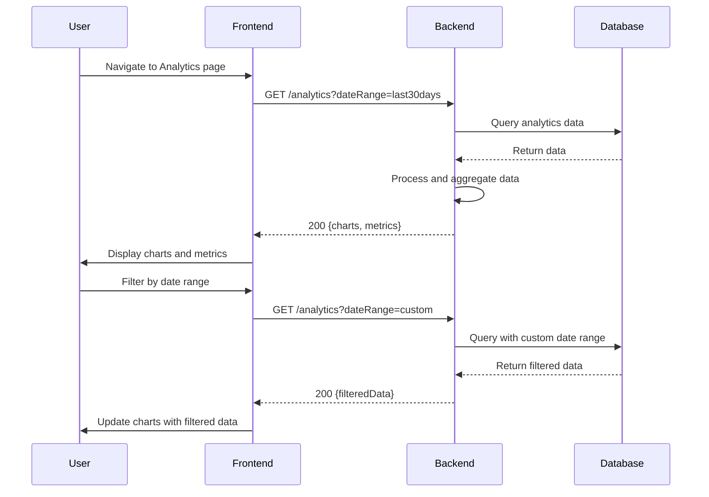
```mermaid
sequenceDiagram
    participant U as User
    participant F as Frontend
    participant B as Backend
    participant DB as Database

    U->>F: Navigate to Analytics page
    F->>B: GET /analytics?dateRange=last30days
    B->>DB: Query analytics data
    DB-->>B: Return data
    B->>B: Process and aggregate data
    B-->>F: 200 {charts, metrics}
    F->>U: Display charts and metrics
    U->>F: Filter by date range
    F->>B: GET /analytics?dateRange=custom
    B->>DB: Query with custom date range
    DB-->>B: Return filtered data
    B-->>F: 200 {filteredData}
    F->>U: Update charts with filtered data
```

##### 4.8 Security & Testing

**Use Case: Enable 2FA**
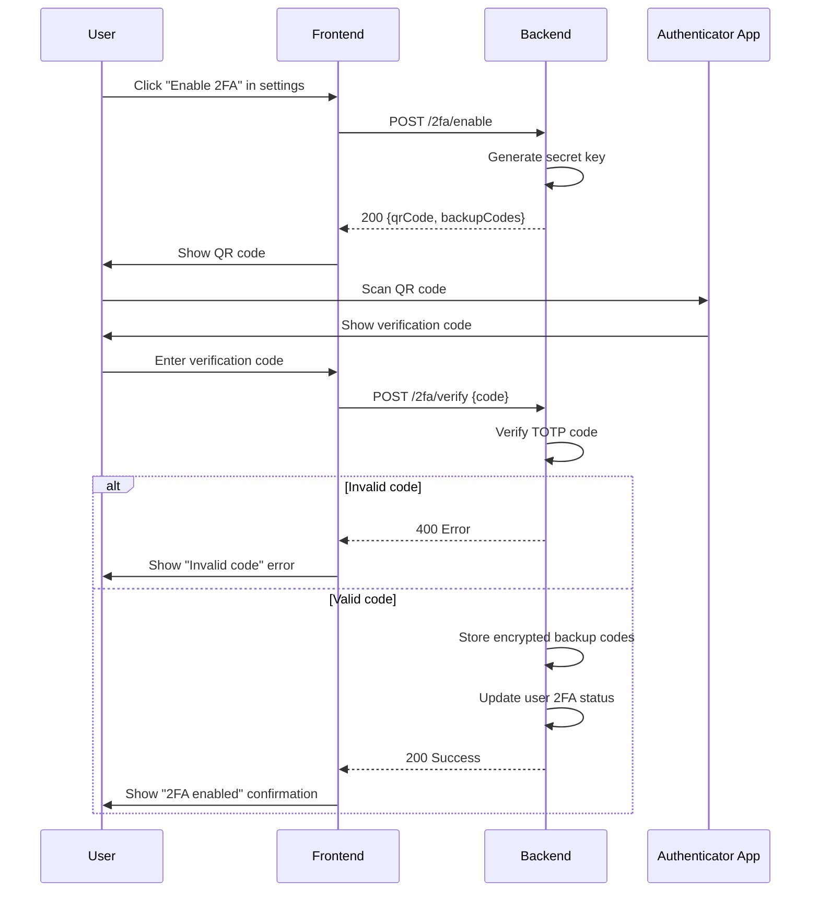
```mermaid
sequenceDiagram
    participant U as User
    participant F as Frontend
    participant B as Backend
    participant A as Authenticator App

    U->>F: Click "Enable 2FA" in settings
    F->>B: POST /2fa/enable
    B->>B: Generate secret key
    B-->>F: 200 {qrCode, backupCodes}
    F->>U: Show QR code
    U->>A: Scan QR code
    A->>U: Show verification code
    U->>F: Enter verification code
    F->>B: POST /2fa/verify {code}
    B->>B: Verify TOTP code
    alt Invalid code
        B-->>F: 400 Error
        F->>U: Show "Invalid code" error
    else Valid code
        B->>B: Store encrypted backup codes
        B->>B: Update user 2FA status
        B-->>F: 200 Success
        F->>U: Show "2FA enabled" confirmation
    end
```

#### 5. APPENDIX A: ERROR CODES

| Code | Message | HTTP Status | Description |
|------|---------|-------------|-------------|
| MSG001 | Message content too long | 400 | Message exceeds 5000 character limit |
| MSG002 | Invalid conversation ID | 404 | Conversation not found |
| MSG003 | User not authorized | 403 | Access denied to conversation |
| MSG004 | Failed to send message | 500 | Internal server error |
| MSG005 | WebSocket connection failed | 500 | Connection error |
| MSG006 | Failed to deliver push notification | 500 | Notification service error |
| MSG007 | File type not supported | 400 | Invalid file format |
| MSG008 | File size exceeds limit | 400 | File > 10MB |
| MSG009 | Upload failed | 500 | Storage service error |
| MSG010 | Failed to update read status | 500 | Database error |
| MOB001 | Invalid email format | 400 | Email validation failed |
| MOB002 | Invalid password | 401 | Authentication failed |
| MOB003 | Account not verified | 403 | Email verification required |
| MOB004 | Too many login attempts | 429 | Rate limiting |
| MOB005 | Project not found | 404 | Invalid project ID |
| MOB006 | Access denied | 403 | Insufficient permissions |
| MOB007 | Failed to register for push notifications | 500 | FCM registration error |
| MOB008 | Invalid device token | 400 | Token validation failed |
| REC001 | Insufficient data for scoring | 400 | Missing profile data |
| REC002 | Scoring algorithm failed | 500 | Algorithm execution error |
| REC003 | No recommendations available | 404 | No matches found |
| REC004 | Failed to fetch recommendations | 500 | Database/query error |
| VID001 | Invalid date/time selected | 400 | Calendar validation failed |
| VID002 | Failed to create meeting link | 500 | Integration service error |
| VID003 | Email delivery failed | 500 | Email service error |
| VID004 | Meeting not found | 404 | Invalid meeting ID |
| VID005 | Not authorized for this meeting | 403 | Access control |
| VID006 | Video service unavailable | 503 | Third-party service down |
| ENG001 | Review period expired | 403 | Time constraint |
| ENG002 | Invalid rating value | 400 | Rating validation |
| ENG003 | Failed to save review | 500 | Database error |
| ENG004 | Badge criteria check failed | 500 | Logic error |
| ENG005 | Failed to award badge | 500 | Database error |
| ADM001 | Invalid CSV format | 400 | File validation |
| ADM002 | Duplicate email found | 409 | Data conflict |
| ADM003 | Failed to create user accounts | 500 | Bulk operation error |
| ADM004 | Invalid template syntax | 400 | Template validation |
| ADM005 | Failed to save template | 500 | Database error |
| ANA001 | No analytics data available | 404 | Data not found |
| ANA002 | Failed to fetch analytics data | 500 | Query error |
| ANA003 | Report generation failed | 500 | Report engine error |
| ANA004 | Invalid export format | 400 | Format validation |
| SEC001 | Invalid verification code | 400 | 2FA code validation |
| SEC002 | Failed to generate QR code | 500 | QR generation error |
| SEC003 | 2FA already enabled | 409 | State conflict |
| SEC004 | Email not found | 404 | Account lookup |
| SEC005 | Invalid reset token | 400 | Token validation |
| SEC006 | Password does not meet requirements | 400 | Password policy |

#### 6. APPENDIX B: API CONTRACTS

##### Authentication API
```
POST /api/auth/login
Request: { email, password }
Response: { accessToken, refreshToken, user }

POST /api/auth/register
Request: { email, password, name, role }
Response: { user, message }

POST /api/auth/refresh
Request: { refreshToken }
Response: { accessToken, refreshToken }
```

##### Messaging API
```
POST /api/conversations
Request: { participantIds }
Response: { conversation }

GET /api/conversations
Response: [Conversation]

GET /api/conversations/:id/messages
Response: [Message]

POST /api/conversations/:id/messages
Request: { content, type }
Response: { message }

PUT /api/conversations/:id/read
Response: { success: true }
```

##### Projects API
```
GET /api/projects
Query: { industry, stage, location, limit, offset }
Response: { projects, totalCount }

GET /api/projects/:id
Response: { project }

POST /api/projects
Request: { title, description, industry, stage }
Response: { project }

PUT /api/projects/:id
Request: { title, description }
Response: { project }
```

##### Matching API
```
POST /api/matches/intent
Request: { targetUserId, type }
Response: { matchIntent }

GET /api/matches
Response: [Match]

GET /api/matches/:id
Response: { match }
```

##### Recommendations API
```
GET /api/recommendations/projects
Response: [RecommendedProject]

GET /api/recommendations/investors
Response: [RecommendedInvestor]

POST /api/recommendations/rate
Request: { targetId, rating }
Response: { success: true }
```

##### Analytics API
```
GET /api/analytics/startup
Response: { profileViews, matchRate, projects }

GET /api/analytics/investor
Response: { projectsViewed, conversations, deals }

POST /api/analytics/export
Request: { format, dateRange }
Response: { downloadUrl }
```

##### Admin API
```
POST /api/admin/users/import
Request: { csvFile }
Response: { success: true, report }

GET /api/admin/templates
Response: [EmailTemplate]

PUT /api/admin/templates/:id
Request: { subject, body, variables }
Response: { template }
```

</details>